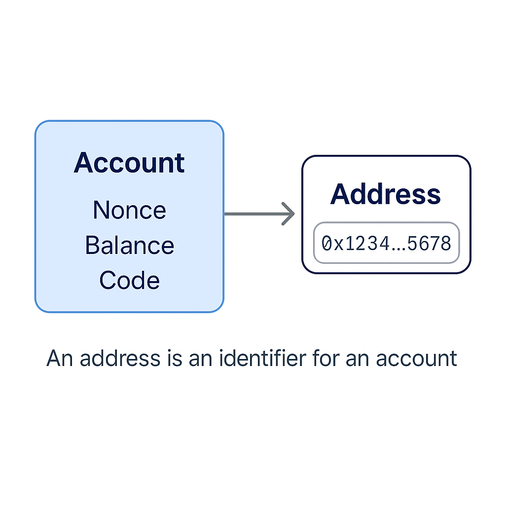

# 区块链钱包基础概念

区块链钱包是用户进入 Web3 世界的第一站。要理解钱包的功能，首先要**抛开**“钱包=资产”的传统观念，真正认识它在去中心化世界中的角色：**私钥管理器 + 用户身份认证器**。

## 钱包的本质：不是“装币”的，而是“控权”的

> 区块链钱包 ≠ 存放资产
>
>
> 区块链钱包 = 控制私钥 + 发起签名
>

区块链资产（如 ETH、ERC-20）是“记录在链上的数据”，不在你的钱包里，而是在一个地址上。

**钱包的功能核心在于：**

- 保存并使用私钥
- 发起链上签名操作（如转账、授权、登录）
- 允许你证明“我是这个地址的控制者”


> 🔍 私钥生成地址，地址持有资产，钱包控制私钥，因此钱包可控制资产。

## 账户类型：EOA 与 合约钱包的本质区别

### ✅ EOA（Externally Owned Account）

- 有私钥控制
- 默认类型，由钱包（如 MetaMask） 创建
- 可直接签名与发起交易

### ✅ 合约钱包（Smart Contract Account）

- 无私钥，由合约逻辑控制
- 支持多签、限额等定制行为
- 签名流程复杂（需 EIP-1271 验证）

| 项目 | EOA | 合约钱包 |
| --- | --- | --- |
| 控制方式 | 私钥 | 智能合约逻辑 |
| 是否支持签名 | ✅ | 需合约实现 EIP-1271 |
| 是否可被升级 | ❌ | ✅（可 Proxy） |
| Gas 支付方式 | 自付 | 可由他人代付（Paymaster） |


## 钱包分类与生态

### ✅ 热钱包（Hot Wallet）

- 在线使用，安装即用
- 易于操作但风险较高（如浏览器插件）
- 典型产品：MetaMask、Coinbase Wallet

### ✅ 冷钱包（Cold Wallet）

- 私钥离线保存，不易被攻击
- 需硬件支持，如 Ledger、Trezor
- 适合大额资产长期保存

### ✅ 托管钱包（Custodial）

- 由平台托管私钥，用户只需账号密码
- 用户无需记住助记词
- 适合新手，安全依赖平台

### ✅ 非托管钱包（Non-custodial）

- 用户自持私钥与助记词
- 完全去中心化，丢失私钥即资产无法找回

| 类别 | 是否联网 | 是否持私钥 | 推荐场景 |
| --- | --- | --- | --- |
| 热钱包 | 是 | ✅ | 高频交易、日常交互，风险高 |
| 冷钱包 | 否 | ✅ | 长期存储、高安全性 |
| 托管钱包 | 是 | ❌ | 新用户、小额场景 |
| 非托管钱包 | 是/否 | ✅ | Web3 爱好者、链上开发者 |

## 主流钱包产品速览

| 钱包 | 类型 | 适用链 | 特点 |
| --- | --- | --- | --- |
| MetaMask | 热钱包（浏览器插件） | EVM | 最广泛使用，支持 Injected Provider |
| Rainbow | 热钱包（移动端） | EVM | UI 优雅，支持 WalletConnect |
| Safe | 合约钱包 | EVM | 多签控制，适合 DAO / 机构 |
| Phantom | 热钱包 | Solana | 支持 NFT 展示与 Swap |
| Coinbase Wallet | 热钱包 | EVM / L2 | 支持 ENS、身份系统 |

## 安全机制解析：助记词、签名、授权与撤销

### ✅ 助记词（Mnemonic）

- 一组 12/24 个单词，**用于生成私钥**
- 推荐使用硬件钱包或安全插件保存
- 不应上传至任何云服务或公开网络

### ✅ 签名（Signature）

- 用户对**消息或交易**进行私钥签名
- 签名后数据无法被篡改，可验证身份

### ✅ 授权（Approve）机制

- ERC20 Token 使用 `approve` + `transferFrom` 实现转账
- 授权容易被滥用，务必限制数量与对象

### ✅ 撤销授权

- 可使用 [Revoke.cash](https://revoke.cash/) 或 Etherscan 的 Token Approvals 工具
- 定期清理授权是良好习惯

## 示例代码（Ethers.js v6 版本）

```tsx
import { Wallet } from 'ethers';

const wallet = Wallet.createRandom();

console.log('地址:', wallet.address);
console.log('助记词:', wallet.mnemonic?.phrase);  // 注意：v6 中为可选属性
console.log('私钥:', wallet.privateKey);

```

### 📌 说明

- `Wallet.createRandom()` 用于生成新钱包
- `mnemonic` 现在是 `Mnemonic | undefined`，建议使用可选链操作符访问
- 默认导入方式已基于 ESM 结构，适配现代构建工具（如 Vite、Next.js）

## 延伸理解

### 💡 我对 Web3 钱包的认识

现实中的钱包用于**装钱**，但 Web3 钱包并不直接“装”任何 token。

> Web3 钱包不存储资产，而是管理私钥。真正拥有资产的是链上的账户，而账户的控制权来自私钥。
>

可以这样理解：

- 区块链像一个**全球通用保险箱系统**
- 私钥就是你打开某个保险箱的**唯一密码**
- 钱包是帮你保存和使用这把“密码”的工具
- 所有 token 都放在链上的地址（账户）中，并不“存在钱包里”

因此，只要有人获得了你的私钥，无论是否使用你的钱包软件，**都可以控制你的账户、转走你的资产**。

### 🔐 私钥与助记词的关系：**一一对应**

- 私钥是一个不可逆的**随机数**（通常为 64 位 hex）
- 助记词（Mnemonic）是私钥的**人类可读版本**，可用于恢复钱包
- 助记词 ↔️ 私钥 是**一一对应**的，只要记住助记词就等于拥有了私钥

> 🧠 所以“保护好助记词”就是“保护好你在链上的资产”
>

---

### 🔐账户与私钥的真实关系：**不是一对一，而是一对多**

在传统理解中，很多人以为：

> 一个私钥 = 一个账户（地址）
>

实际上，在基于 BIP-32/44 助记词派生标准的钱包中：

> 一个私钥（准确说是“主私钥”）可以派生出多个账户（地址）
>

#### ✅ 示例：MetaMask 中的多账户

- 当你在 MetaMask 中点击「创建账户」时，并不会生成新的助记词或私钥
- 它只是基于你当前钱包的**助记词 + 派生路径（如 m/44'/60'/0'/0/x）**继续生成新的地址
- 这些地址虽然看起来是“多个账户”，本质上**都由同一组助记词（主私钥）控制**

---

#### 📌 地址泄漏不是安全风险，**私钥泄漏才是**

- 账户地址（如 `0x123...`) 是公开的，你的链上活动本身就是公开透明的
- 即使别人知道了你的地址，他们也无法操作你的账户
- 因为区块链交易必须通过**私钥签名**才能被验证为“合法发起者”

> ✅ 你可以理解为：
>
> 地址 = 银行账号（公开可收款）
>
> 私钥 = 银行 U 盾 + 签名章（必须私密）
>

---

### 📌 账户与地址的关系

**地址（Address）是账户的标识符，账户（Account）是区块链状态机中的“主体单元”**

> 身份证号码是人的唯一标识一样，地址是账户在链上的唯一标识
>

以太坊中，每个账户有一组状态数据：

- nonce（交易次数）
- balance（ETH余额）
- storageRoot（仅合约账户有）
- codeHash（是否部署合约）

而地址只是访问这个账户状态的“入口坐标”。

在大多数开发与文档语境中，可以认为“账户”和“地址”是等价的术语



### 📘关系图谱

**助记词 → 主私钥 → 派生路径 → 多个账户（地址） → 链上资产**

- 🔑 助记词（Mnemonic）
- 🔐 主私钥（Master Private Key）
- 🧭 派生路径（Derivation Path）
- 📬 地址（Address）
- 💰 资产状态（Token, ETH, NFT）


> 每个地址（账户）在区块链上都是**独立的身份**
>