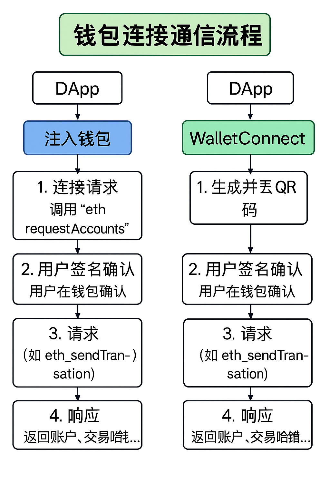

# 钱包连接协议详解

## 为什么需要“连接协议”？

连接钱包 ≠ 直接读取账户

连接钱包 = 建立一套**通信桥梁协议**，让 DApp 能通过浏览器或中继服务与钱包交互：

- 请求地址、签名消息、发送交易等操作
- 响应用户确认、拒绝、错误等事件

## EIP-1193：统一的钱包通信接口规范

浏览器**注入类钱包**（如 MetaMask）过去各自定义接口，导致开发者适配成本高。**EIP-1193** 是一个标准化接口规范，规定了钱包提供者（Provider）的行为。

### 关键定义

- 所有**注入钱包**都会在页面中注入一个 `window.ethereum` 对象
- 所有调用遵循统一格式：

    ```tsx
    await window.ethereum.request({ method: 'eth_requestAccounts' });
    ```

### 常见方法

| 方法 | 描述 |
| --- | --- |
| `eth_requestAccounts` | 请求连接钱包地址（触发连接弹窗） |
| `eth_chainId` | 获取当前链 ID |
| `eth_sendTransaction` | 发起交易请求 |
| `personal_sign` / `eth_signTypedData_v4` | 发起签名请求 |
| `wallet_switchEthereumChain` | 切换链网络 |

---

## WalletConnect 协议详解

### ✅ WalletConnect 是什么？

> WalletConnect 是一种**基于 QR 码 + WebSocket** 的钱包连接协议
>
>
> 它让**浏览器 DApp ↔️ 手机钱包**之间实现交互
>

### ✅ v1 与 v2 差异

| 对比项 | WalletConnect v1(已废弃) | WalletConnect v2 （主流） |
| --- | --- | --- |
| 通信方式 | 临时 Session | 持久 Session |
| 多链支持 | ❌ | ✅ |
| 消息标准 | 自定义 | JSON-RPC |
| 底层架构 | WebSocket + Bridge | WebSocket + Relay Server |
| 生命周期控制 | 单一连接 | 多 session、可主动断开 |
| 项目 ID | 无需 | 必须（由 WalletConnect 控制台申请） |

---

## 钱包连接通信流程详解

### ✅ Injected Wallet 连接流程（如 MetaMask）

1. 用户点击“连接钱包”按钮
2. DApp 调用：

    ```tsx
    await window.ethereum.request({ method: 'eth_requestAccounts' });
    ```

3. 用户在钱包中点击“确认连接”
4. 钱包返回地址，连接成功

### ✅ WalletConnect 连接流程

1. DApp 创建连接 session，生成 QR 码
2. 用户手机钱包扫码，接入中继服务器
3. 钱包确认连接，回传账户地址
4. DApp 接收账户与链 ID，进入连接状态



## 代码示例（以 Ethers v6 为例）

### ✅ 1. 使用 EIP-1193 发起连接请求

```tsx
const provider = window.ethereum;

if (!provider) {
  console.error('请安装钱包插件');
  return;
}

const accounts = await provider.request({
  method: 'eth_requestAccounts',
});

console.log('连接账户:', accounts[0]);
```

### ✅ 2. 获取当前网络链 ID

```tsx
const chainId = await provider.request({ method: 'eth_chainId' });
console.log('当前链 ID:', parseInt(chainId, 16));
```

### ✅ 3. 发起交易请求（Ethers v6）

```tsx
import { BrowserProvider } from 'ethers';

const browserProvider = new BrowserProvider(window.ethereum);
const signer = await browserProvider.getSigner();

const tx = await signer.sendTransaction({
  to: '0xabc...',
  value: parseEther('0.01'),
});

await tx.wait();
console.log('交易已上链');
```

---

### 多设备扫码连接原理（WalletConnect）

### ✅ 连接过程分析

- DApp 生成一个 session topic（会话主题）
- 使用 WalletConnect 提供的**中继服务器**，将连接请求写入该 session
- 生成 QR 码：编码 session + Relay 地址
- 手机端钱包扫码并解析 session → 链接中继服务器
- 用户确认连接后，Session 建立，通信开始

### WalletConnect v2 实现示例

- 安装依赖

    ```bash
    pnpm add wagmi viem @walletconnect/ethereum wagmi/connectors
    ```

    > 🚨 注意：你需要在 WalletConnect 官方平台（<https://cloud.walletconnect.com）注册获取一个> Project ID
    >

---

- 📦 配置 connectors

    ```tsx
    // lib/walletConnect.ts
    import { walletConnect } from 'wagmi/connectors'
    import { WalletConnectConnector } from '@wagmi/connectors/walletConnect'
    import { mainnet } from 'wagmi/chains'
    
    export const walletConnectConnector = walletConnect({
      projectId: 'YOUR_PROJECT_ID', // 👉 替换成你的真实 ID
      metadata: {
        name: 'My DApp',
        description: 'DApp 前端连接示例',
        url: 'https://mydapp.example',
        icons: ['https://mydapp.example/icon.png'],
      },
      showQrModal: true,
    })
    
    ```

---

- ⚙️ 创建 wagmi config

    ```tsx
    // lib/wagmi.ts
    import { createConfig, configureChains } from 'wagmi'
    import { publicProvider } from 'wagmi/providers/public'
    import { walletConnectConnector } from './walletConnect'
    import { mainnet } from 'wagmi/chains'
    
    const { publicClient } = configureChains(
      [mainnet],
      [publicProvider()],
    )
    
    export const wagmiConfig = createConfig({
      autoConnect: true,
      publicClient,
      connectors: [walletConnectConnector],
    })
    ```

---

- 🧩 在应用中包裹 Provider

    ```tsx
    // app/layout.tsx or _app.tsx
    import { WagmiProvider } from 'wagmi'
    import { wagmiConfig } from '@/lib/wagmi'
    
    export default function App({ children }) {
      return (
        <WagmiProvider config={wagmiConfig}>
          {children}
        </WagmiProvider>
      )
    }
    ```

---

- 🧪 发起连接 + 获取账户信息

    ```tsx
    'use client'
    
    import { useConnect, useAccount, useDisconnect } from 'wagmi'
    
    export function WalletConnectButton() {
      const { connect, connectors } = useConnect()
      const { address, isConnected } = useAccount()
      const { disconnect } = useDisconnect()
    
      const walletConnect = connectors.find(c => c.name === 'WalletConnect')
    
      return (
        <div>
          {isConnected ? (
            <>
              <p>已连接地址：{address}</p>
              <button onClick={() => disconnect()}>断开连接</button>
            </>
          ) : (
            <button onClick={() => connect({ connector: walletConnect! })}>
              使用 WalletConnect 连接钱包
            </button>
          )}
        </div>
      )
    }
    ```

---

## 钱包连接协议的发展趋势

- **WalletConnect v2** 已成为当前主流协议，支持多链、持久连接与中继服务器架构，是前端与移动钱包交互的核心通信标准。
- **Web3Modal v3**（由 WalletConnect 团队推出）在 UI 层面提供现代化连接体验，支持模块化配置、轻量加载、AuthKit（邮箱登录、Passkey 登录）等增强能力，成为前端集成 WalletConnect 的新标准。
- **MetaMask Snaps** 正式引入插件化机制，未来将实现对自定义链、账户抽象钱包、DID、ZK 登录等模块的原生支持。
