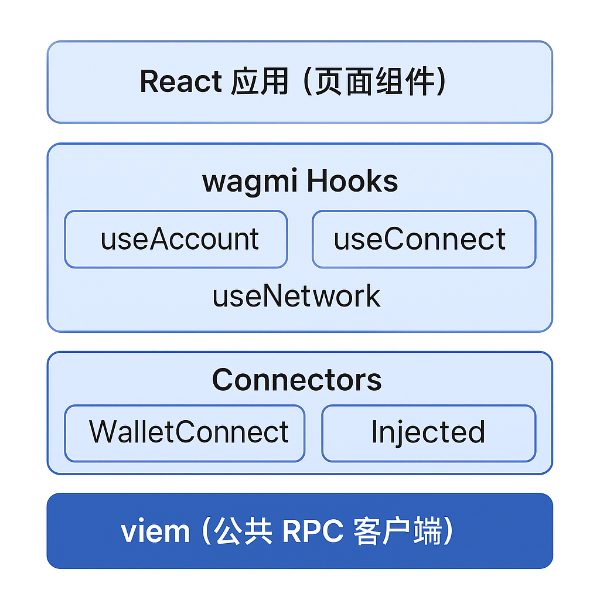

# 前端钱包连接实现（以 wagmi 为核心）

使用 wagmi + viem 工具链，在前端实现高质量的钱包连接模块，包括状态管理、自动连接、网络切换、多连接器支持等核心功能。

## wagmi 与 viem 简介

### ✅ wagmi： React版 钱包连接的现代标准

- 基于 React Hooks 的 Web3 工具集
- 封装了连接器、状态管理、交易签名等功能
- 与 RainbowKit、Web3Modal、WalletConnect 深度集成

### ✅ viem：RPC 层轻量客户端

- 替代 ethers.js 的现代 TypeScript 工具库
- 更小、更快、更符合函数式风格
- wagmi 默认使用 viem 作为公共客户端（publicClient）

## 项目初始化配置



### ✅ 安装依赖

```bash
pnpm add wagmi viem @wagmi/core @walletconnect/ethereum
```

### ✅ 创建wagmi config

```tsx
// lib/wagmi.ts
import { createConfig, configureChains } from 'wagmi'
import { mainnet, polygon } from 'wagmi/chains'
import { publicProvider } from 'wagmi/providers/public'
import { walletConnect } from 'wagmi/connectors'
import { injected } from 'wagmi/connectors'

const { chains, publicClient } = configureChains(
  [mainnet, polygon],
  [publicProvider()],
)

export const config = createConfig({
  autoConnect: true,
  publicClient,
  connectors: [
    injected(),
    walletConnect({
      projectId: 'YOUR_PROJECT_ID',
      showQrModal: true,
    }),
  ],
})
```

> ✅ 支持**多链**与**多连接器**切换，未来可集成 RainbowKit 或 Web3Modal UI。
>

---

## 应用中注入 Provider

```tsx
// app/layout.tsx or _app.tsx
import { WagmiProvider } from 'wagmi'
import { config } from '@/lib/wagmi'

export default function App({ children }) {
  return (
    <WagmiProvider config={config}>
      {children}
    </WagmiProvider>
  )
}
```

---

## 连接钱包核心功能封装

```tsx
// 基础连接按钮组件
'use client'

import {
  useConnect,
  useDisconnect,
  useAccount,
  useEnsName,
} from 'wagmi'

export function ConnectWalletButton() {
  const { connect, connectors } = useConnect()
  const { disconnect } = useDisconnect()
  const { address, isConnected } = useAccount()
  const { data: ensName } = useEnsName({ address })

  const connector = connectors[0] // 默认使用第一个连接器（如 Injected）

  return isConnected ? (
    <div>
      <p>已连接：{ensName ?? address}</p>
      <button onClick={() => disconnect()}>断开连接</button>
    </div>
  ) : (
    <button onClick={() => connect({ connector })}>
      连接钱包
    </button>
  )
}
```

---

## 自动连接与状态管理策略

在 `createConfig` 中设置：

```tsx
// 自动连接配置
autoConnect: true
```

wagmi 会：

- 尝试恢复上次使用过的连接器
- 从 localStorage 中读取持久化状态

### ✅ 监听连接状态变化

```tsx
import { useAccount } from 'wagmi'

const { isConnected, address } = useAccount()

useEffect(() => {
  if (isConnected) {
    console.log('用户已连接地址:', address)
  }
}, [isConnected])
```

> 📌 可用于判断是否进入登录签名流程、是否展示资产信息等。
>

---

## 网络切换与多链支持

### ✅ 获取当前链 ID 与切换链

```tsx
import { useNetwork, useSwitchChain } from 'wagmi'

const { chain } = useNetwork()
const { chains, switchChain } = useSwitchChain()

return (
  <selectvalue={chain?.id}
    onChange={(e) => switchChain({ chainId: Number(e.target.value) })}
  >
    {chains.map((c) => (
      <option key={c.id} value={c.id}>
        {c.name}
      </option>
    ))}
  </select>
)
```

### ✅ 处理网络不匹配提示

- wagmi 会暴露 `chainUnsupported` 标志
- 可主动提示用户“请切换至主网”或自动触发切换请求

---

## 实战建议与组件封装策略

**推荐封装组件**

| 组件名 | 功能描述 |
| --- | --- |
| `WalletIdentityCard` | 展示地址 / ENS / 合约钱包标识 |
| `ConnectWalletButton` | 钱包连接主入口，状态反馈 |
| `ChainSwitcherDropdown` | 多链切换下拉框 |
| `SignatureLoginGuard` | 登录保护封装，未连接不允许进入功能页 |

**UI 与 UX 提示建议**

| 场景 | 提示设计 |
| --- | --- |
| 未安装钱包 | 弹窗提示 + 下载链接 |
| 正在连接中 | 加载动画 + 灰化按钮 |
| 链不支持 | 高亮警告 + 切换链选项 |
