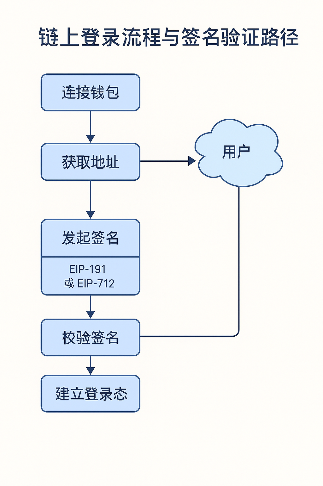

# 登录签名机制与链上身份识别

## 为什么需要“登录签名”？

连接钱包 **≠** 登录

登录本质是**对钱包地址的所有权确认 + 签名认证 + 状态持久化**：

| 步骤 | 描述 |
| --- | --- |
| 1️⃣ 连接钱包 | 获取地址 |
| 2️⃣ 生成消息 | 携带时间戳 + 随机 nonce |
| 3️⃣ 用户签名 | 通过钱包私钥签署消息 |
| 4️⃣ 服务端验证 | 校验签名结果与 nonce |
| 5️⃣ 保存登录态 | 发放 token / session |



## EIP-191：通用文本签名（`personal_sign`）

### ✅ 特点

- 支持任意字符串签名
- 快速易用、兼容性好
- 不具备结构化验证能力（不适合生产登录）

### ✅ 示例代码（Ethers.js v6）

```tsx
import { BrowserProvider } from 'ethers'

const provider = new BrowserProvider(window.ethereum)
const signer = await provider.getSigner()

const message = `登录 DApp，请签名确认\n时间：${Date.now()}`
const signature = await signer.signMessage(message)
```

> ⚠️ 适用于简单认证或 Demo 环境，不推荐用于登录授权生产环境。
>

---

## EIP-712：结构化数据签名（`eth_signTypedData_v4`）

### ✅ 特点

- 支持结构化字段与域隔离
- 防钓鱼、强验证性
- 推荐用于安全登录、权限签名、授权凭证等场景

### ✅ 示例签名域

```tsx
const domain = {
  name: 'MyDApp',
  version: '1',
  chainId: 1,
  verifyingContract: '0xCcCCccccCCCCcCCCCCCcCcCccCcCCCcCcccccccC',
}

const types = {
  Login: [
    { name: 'address', type: 'address' },
    { name: 'nonce', type: 'string' },
  ]
}

const message = {
  address: userAddress,
  nonce: 'abc123',
}
```

### ✅ 发起签名（Ethers v6）

```tsx
const signature = await signer.signTypedData(domain, types, message)
```

---

## SIWE：Sign-In With Ethereum 标准协议

### ✅ 由 Ethereum Foundation 提出

统一链上登录格式标准，结合 `EIP-4361` 消息规范，支持钱包间兼容、服务端验证。

### ✅ 登录消息格式示意

```yaml
example.com wants you to sign in with your Ethereum account:
0xabc...1234

Sign-In Request at 2025-06-18T15:32:12Z
Nonce: 9xb293
URI: https://example.com
Version: 1
Chain ID: 1
```

### ✅ 推荐使用库

```bash
pnpm add siwe
```

```tsx
import { SiweMessage } from 'siwe'

const msg = new SiweMessage({
  domain: 'example.com',
  address,
  statement: 'Sign in to MyDApp',
  uri: window.location.origin,
  version: '1',
  chainId: 1,
  nonce,
  issuedAt: new Date().toISOString(),
})

const prepared = msg.prepareMessage()
const signature = await signer.signMessage(prepared)
```

### ✅ 服务端验证建议

- 校验地址、nonce、时效性
- 返回登录凭证（JWT / Session / token）

---

## 链上身份系统

### ✅ ENS（Ethereum Name Service）

- 支持为地址设置 `.eth` 名称
- 可解析头像、社交信息、合约控制权等
- 查询方式（wagmi）：

```tsx
import { useEnsName, useEnsAvatar } from 'wagmi'

const { data: ensName } = useEnsName({ address })
const { data: avatar } = useEnsAvatar({ name: ensName })
```

### ✅ 合约钱包识别与签名验证（EIP-1271）

> 合约钱包不能使用标准 signMessage，必须调用合约内 isValidSignature() 方法验证。
>

### ✅ 识别合约钱包 + 兼容性处理

```solidity
async function isContractWallet(address: string, provider: JsonRpcProvider) {
  const code = await provider.getCode(address)
  return code !== '0x'
}
```

若是合约钱包，使用 EIP-1271：

```solidity
function isValidSignature(bytes32 hash, bytes signature)
  external
  view
  returns (bytes4 magicValue); // 0x1626ba7e
```

---

## 推荐组件封装与 UX 提示

| 组件名 | 作用 |
| --- | --- |
| `useSignatureLogin` | 封装签名 + 校验逻辑，暴露登录状态 |
| `LoginGate` | 路由级别鉴权封装（未登录跳转） |
| `UserIdentityCard` | 展示 ENS、合约钱包标识、头像 |
| `SignaturePrompt` | 签名弹窗提示组件（签名中状态反馈） |

### `useSignatureLogin.ts`

```tsx
import { useCallback, useState } from 'react'
import { BrowserProvider, verifyMessage } from 'ethers'
import { useAccount } from 'wagmi'

export function useSignatureLogin() {
  const { address, isConnected } = useAccount()
  const [isLoggingIn, setIsLoggingIn] = useState(false)
  const [isLoggedIn, setIsLoggedIn] = useState(false)

  const login = useCallback(async () => {
    if (!isConnected || !window.ethereum) return

    setIsLoggingIn(true)
    try {
      const provider = new BrowserProvider(window.ethereum)
      const signer = await provider.getSigner()

      const nonce = crypto.randomUUID()
      const message = `Sign in to DApp\nAddress: ${address}\nNonce: ${nonce}`
      const signature = await signer.signMessage(message)

      const isValid = await verifyMessage(message, signature) === address
      if (isValid) {
        setIsLoggedIn(true)
        // 可选：保存 token / session / 发起后端请求
      }
    } catch (err) {
      console.error('签名登录失败:', err)
    } finally {
      setIsLoggingIn(false)
    }
  }, [address, isConnected])

  return { isLoggedIn, isLoggingIn, login }
}
```

---

### `LoginGate.tsx`（页面级登录权限控制）

```tsx
'use client'

import { useEffect } from 'react'
import { useRouter } from 'next/navigation'
import { useAccount } from 'wagmi'
import { useSignatureLogin } from '@/hooks/useSignatureLogin'

export function LoginGate({ children }: { children: React.ReactNode }) {
  const router = useRouter()
  const { isConnected } = useAccount()
  const { isLoggedIn, login } = useSignatureLogin()

  useEffect(() => {
    if (!isConnected) return
    if (!isLoggedIn) login()
  }, [isConnected, isLoggedIn])

  if (!isConnected) {
    return <p>请先连接钱包</p>
  }

  if (!isLoggedIn) {
    return <p>正在登录中...</p>
  }

  return <>{children}</>
}
```

---

### `UserIdentityCard.tsx`（展示 ENS 名称、头像、合约钱包状态）

```tsx
tsx
复制编辑
'use client'

import { useAccount, useEnsName, useEnsAvatar } from 'wagmi'
import { useEffect, useState } from 'react'
import { BrowserProvider } from 'ethers'

export async function isContractWallet(address: string) {
  const provider = new BrowserProvider(window.ethereum)
  const code = await provider.getCode(address)
  return code !== '0x'
}

export function UserIdentityCard() {
  const { address } = useAccount()
  const { data: ensName } = useEnsName({ address })
  const { data: avatar } = useEnsAvatar({ name: ensName ?? undefined })
  const [isContract, setIsContract] = useState(false)

  useEffect(() => {
    if (!address) return
    isContractWallet(address).then(setIsContract)
  }, [address])

  return (
    <div className="border rounded-xl p-4 space-y-2 w-full max-w-sm">
      {avatar && }
      <p>地址：{address}</p>
      <p>ENS：{ensName ?? '未设置'}</p>
      <p>账户类型：{isContract ? '合约钱包' : '普通钱包（EOA）'}</p>
    </div>
  )
}
```

---

### `SignaturePrompt.tsx`（签名请求时的 UI 状态反馈）

```tsx
'use client'

import { useSignatureLogin } from '@/hooks/useSignatureLogin'

export function SignaturePrompt() {
  const { isLoggingIn } = useSignatureLogin()

  if (!isLoggingIn) return null

  return (
    <div className="fixed top-4 right-4 p-3 bg-blue-100 border border-blue-400 rounded-xl text-sm shadow-md">
      ✍️ 请在钱包中签名以完成登录
    </div>
  )
}
```

---

### 推荐搭配用法（页面层）

```tsx
import { LoginGate } from '@/components/LoginGate'
import { UserIdentityCard } from '@/components/UserIdentityCard'
import { SignaturePrompt } from '@/components/SignaturePrompt'

export default function ProtectedPage() {
  return (
    <LoginGate>
      <SignaturePrompt />
      <UserIdentityCard />
      {/* ...其余内容 */}
    </LoginGate>
  )
}
```

> 以上代码，全部 基于 **React + wagmi v2 + Ethers.js v6 + TypeScript**
>