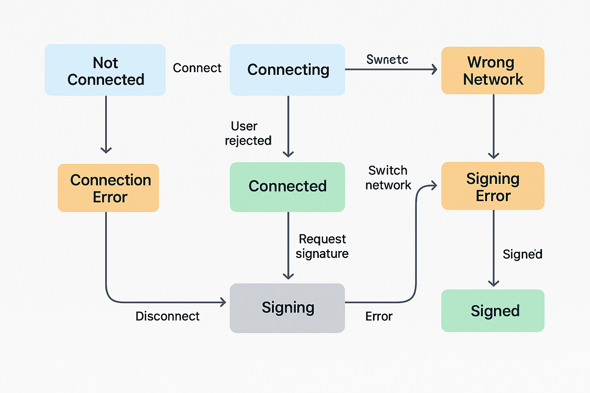

# 钱包交互中的 UI/UX 设计模式

### 核心设计理念：**Web3 UX ≠ Web2 UX**

- 钱包是外部依赖，连接非默认状态 → **UX 必须引导**
- 链接、签名、交易存在延迟与拒绝风险 → **必须提供清晰反馈**
- 钱包类型、链网络、账户状态不统一 → **需做差异化处理**

### 常见交互场景设计

| 场景 | 交互建议 |
| --- | --- |
| 钱包未连接 | 显示连接按钮，隐藏需登录内容 |
| 钱包连接中 | 显示加载动画，禁用二次操作 |
| 用户拒绝连接 | 弹窗提示 + toast 错误信息 |
| 钱包断开连接 | 自动清空登录状态并回退界面 |
| 网络不匹配 | 自动切链或提示“请切换至主网” |
| 用户签名中 | 显示签名提示（不可重复点击） |
| 签名失败 | toast 错误提示并允许重试 |
| 钱包未安装 | 显示下载链接或跳转钱包官网 |
| 合约钱包签名失败 | 提示“当前钱包为合约钱包，需支持 EIP-1271” |



### PC 端交互模式设计

- 强调用户操作可视化（按钮状态、toast 提示）
- 交互流程清晰可控（连接 → 签名 → 状态确认）

通常建议这样设计UI组件：

| 组件 | 功能说明 |
| --- | --- |
| `ConnectWalletButton` | 清晰展示当前连接状态 + 一键连接 |
| `NetworkSwitcherDropdown` | 多链选择，支持自动或手动切换 |
| `SignaturePrompt` | 签名时提示用户在钱包确认 |
| `ToastManager` | 状态反馈：成功 / 失败 / 警告等 |

### `ConnectWalletButton`

```tsx
<button
  disabled={isLoading}
  onClick={connect}
  className="px-4 py-2 bg-blue-600 text-white rounded-lg hover:bg-blue-700 disabled:opacity-60"
>
  {isLoading ? 'Connecting...' : isConnected ? shortenAddress(address) : 'Connect Wallet'}
</button>

```

### `NetworkSwitcherDropdown`

```tsx
<select
  onChange={(e) => switchChain({ chainId: Number(e.target.value) })}
  className="border rounded px-3 py-1"
>
  {chains.map((c) => (
    <option key={c.id} value={c.id}>
      {c.name}
    </option>
  ))}
</select>

```

---

### `SignaturePromopt`

```jsx
// components/SignaturePromopt.tsx

use client'

import { useSignaturePrompt } from '@/hooks/useSignaturePrompt'

export function SignaturePrompt({ visible }: { visible: boolean }) {
  if (!visible) return null

  return (
    <div className="fixed top-4 left-1/2 -translate-x-1/2 z-50 bg-indigo-600 text-white px-4 py-2 rounded-xl shadow-lg text-sm sm:text-base">
      ✍️ Please confirm the signature in your wallet
    </div>
  )
}

//hooks/useSignaturePrompt.tsx
import { useState } from 'react'

export function useSignaturePrompt() {
  const [visible, setVisible] = useState(false)

  const show = () => setVisible(true)
  const hide = () => setVisible(false)

  return { visible, show, hide }
}

// Header.tsx 或 App.tsx 

const { visible, show, hide } = useSignaturePrompt()

<Button onClick={() => {
  show()
  await signer.signMessage('...')
  hide()
}} />
<SignaturePrompt visible={visible} />

```

###

Toast

```jsx
//1. lib/toast.ts
import { toast } from 'sonner'

export const showSuccess = (msg: string) => toast.success(msg)
export const showError = (msg: string) => toast.error(msg)
export const showInfo = (msg: string) => toast(msg)

//2. ToastManager.tsx
'use client'
import { Toaster } from 'sonner'

export function ToastManager() {
  return <Toaster position="top-right" richColors expand={true} />
}

//3. _app.tsx 或 layout.tsx 中
<ToastManager />
```

---

### 移动端交互模式设计

- 精简操作步骤（点击即连接 / 签名）
- 支持 WalletConnect 二维码或深链跳转
- 提示信息简短、空间占用低

| 场景 | 推荐做法 |
| --- | --- |
| 钱包未安装 | 提示安装 + 跳转 App Store 进行安装wallet |
| 使用 WalletConnect | 默认展示扫码弹窗或 `w3m://` 跳转 |
| 签名中 | 固定顶部提示 + loading spinner |
| 网络错误 | 简洁提示：“Wrong network. Tap to switch” |

---

### 常见 UX 误区

| 错误做法 | 正确做法 |
| --- | --- |
| 链接失败无提示 | 使用 toast 反馈 |
| 网络不对直接报错 | 引导切换链 |
| 钱包未安装直接跳转 | 显示提示 + 下载链接 |
| 签名失败直接中断 | 支持重试 + 错误提示 |
