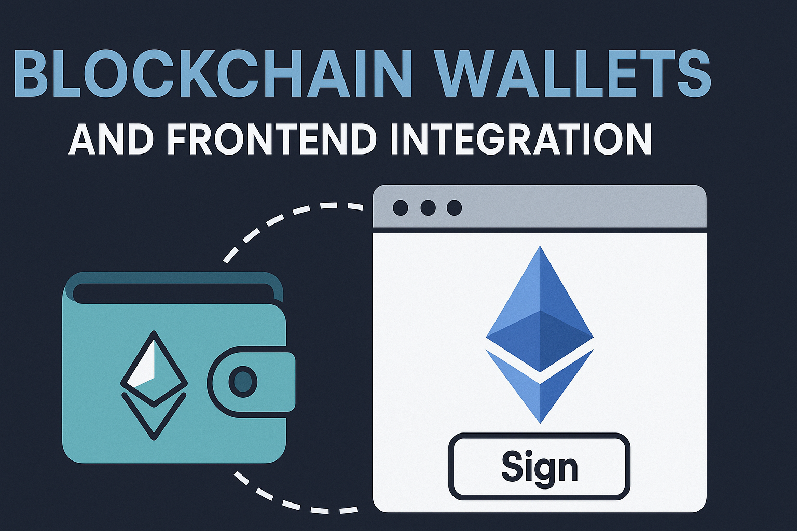

# 📦 专题二：区块链钱包与前端集成实战

---

区块链钱包是 Web3 世界的入口。对于 Web3 初学者和求职者来说，理解钱包的工作原理、连接协议与前端集成方式，是迈入去中心化开发的第一步。本专题从理论到实战，系统讲解钱包类型、连接协议（如 WalletConnect、EIP-1193）、登录签名流程（EIP-191、EIP-712）、以及如何使用 wagmi + viem 等现代前端工具实现高质量的钱包连接模块。同时，还涵盖 ENS、合约钱包、UI/UX 最佳实践与常见坑点，帮助你真正掌握“从连接钱包到登录验证”的完整链路。适合希望进入 Web3 行业的前端开发者与技术转型者。

## 📚 章节目录

[📘钱包基础概念](./01_wallet_basic.md)

[📘钱包连接协议详解](./02_wallet_connect_protocol.md)

[📘前端钱包连接实现（wagmi + viem）](./03_wallet_connect.md)

[📘登录签名与链上身份识别](./04_login_sign.md)

[📘钱包交互中的 UI/UX 设计](./05_wallet_uiux.md)

[📘常见问题与调试清单](./06_wallet_connect_error.md)

[📘附录：WalletConnect v2 与 Web3Modal v3 区别与用法](./07_walletConnect_web3Modal.md)

> 📂 所属仓库：[ethereum-architecture-guide](../../README.md)
