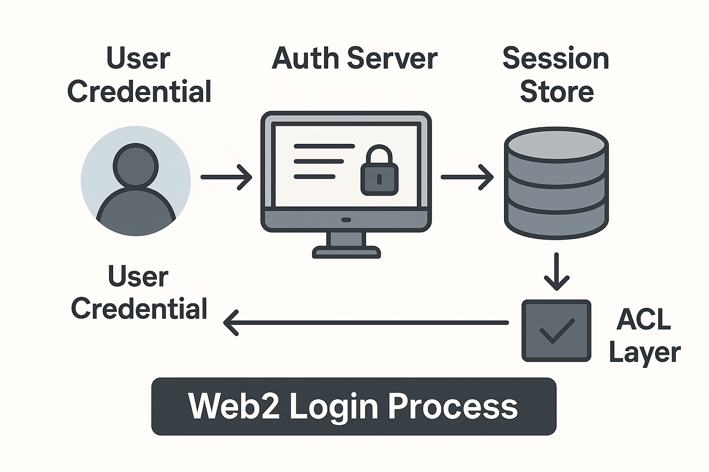

# Web 登录机制演进史：从 Session 到 Signature

「登录」从不是单一的技术点，而是整个**认证信任体系（Auth Trust Stack）**的核心切片。

Web3 登录的本质，不是“钱包替代账号”，而是**客户端承担身份证明逻辑，服务端退化为签名验证者**

。

## 从登录到信任控制：Web2 的身份边界

在 Web2 系统中，“登录” 是整个用户态生命周期的**入口点**，牵涉到以下关键组件：

| 组件角色 | 职责说明 |
| --- | --- |
| `User Credential` | 用户输入（账号/密码、验证码、OAuth Token） |
| `Auth Server` | 负责校验凭证、签发 Token（SessionId/JWT） |
| `Session Store` | 存储 Token 状态（Redis / DB / Cookie） |
| `ACL Layer` | 鉴权中间件，验证 Token 并决定访问权限 |

### ✅ 特征

- 身份校验 **100% 由服务端掌控**；
- 客户端是“身份索取者”，信任的是服务端；
- 安全依赖 **边界控制 + Token 管理**，即传统 **边界型安全模型（perimeter security）**。

## 登录流程的抽象模型

## 为什么 Web3 要重构“登录”？

> 🔥 本质变革：**“信任位置”改变了**
>

| 关键维度 | Web2 | Web3 |
| --- | --- | --- |
| 身份验证者 | 服务端 | 客户端（用私钥签名） |
| 授权载体 | Session / JWT | 钱包签名消息 |
| 身份凭证 | 账号/密码 / OAuth | 钱包私钥控制地址 |
| 鉴权行为 | Token 校验 + ACL | 验证签名是否 match 该 address |
| 权限控制 | 服务端 ACL | 合约权限 / 链上状态 / 签名域 |

## Web3 的认证栈：去中心化登录的构建方式

Web3 登录是一个 **去中心化认证栈（Decentralized Auth Stack）**：

| 层级 | 对应组件 | Web2 类比 |
| --- | --- | --- |
| 签名层 | Wallet Signer（`eth_sign` / `EIP-712`） | 密码、验证码 |
| 身份层 | Address / ENS / DID | 用户 ID、邮箱 |
| 校验层 | Signature Verifier | Auth Server |
| 状态层 | JWT / Session（本地持久化） | Redis、DB session |
| 授权层 | 合约逻辑 / On-chain 权限 | ACL / RBAC |

## 工程迁移图谱：构建 Web3 登录时，你要迁移的抽象是哪些？

| 抽象能力 | Web2 实现 | Web3 对应 |
| --- | --- | --- |
| 身份注册 | 注册接口 + 密码哈希 | 钱包首次连接 + ENS 注册（可选） |
| 登录动作 | 提交凭证，返回 Token | 请求签名，后端验证签名，返回 JWT |
| 用户状态存储 | Session Store（Redis） | localStorage / Zustand / IndexedDB |
| 鉴权控制 | Token 校验 + ACL 权限判断 | 签名验证 + On-chain 判断角色 |

## 深度对比：为什么说“签名比密码安全”？

| 特性 | 密码 | 签名 |
| --- | --- | --- |
| 可复用性 | 易被重用 / 泄露 | 每次签名均可带 nonce，防重放 |
| 可钓鱼性 | 用户难辨真伪页面 | 可加签名文案 / 域名绑定 |
| 存储风险 | 数据库泄露 = 大规模爆破 | 私钥仅保存在用户设备 |
| 主体控制 | 被服务端主导 | 由用户主导，签名即身份主张 |

## 🧠 小结：身份不再属于中心化系统，它属于用户签名本身

Web3 登录不是“没有账号”，而是将「**身份主权**」还给用户，把「**信任判断**」迁移到客户端签名与服务端验证机制上。
