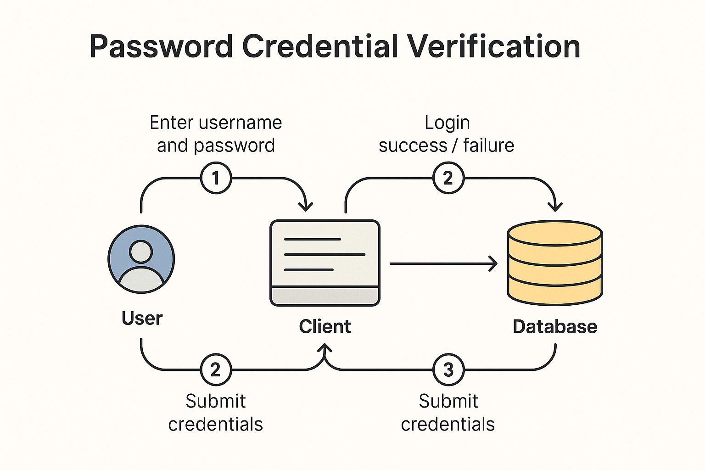
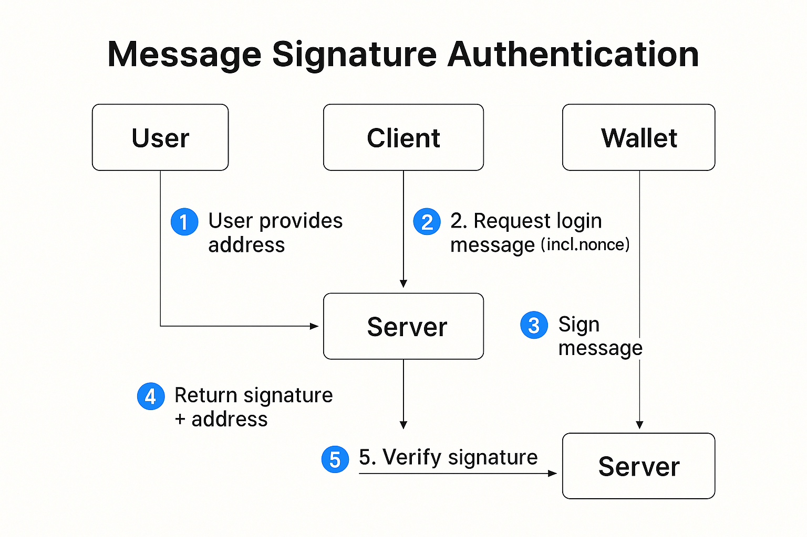
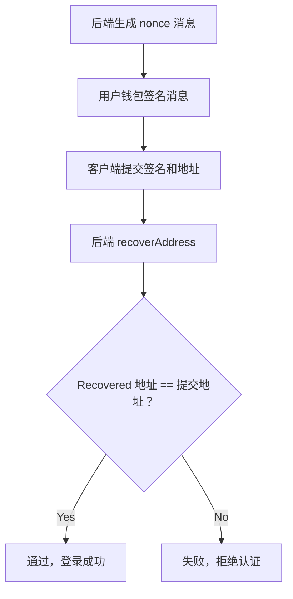

# 从输入密码到签名消息：认证逻辑的根本转变

本章深入剖析了 Web3 登录中最核心的认证机制 —— 数字签名，帮助读者理解从「输入密码」到「签名消息」的本质转变。通过对 `eth_sign`、`personal_sign`、EIP-191 等签名标准的讲解，我们构建了完整的签名验证流程，包括签名格式、地址恢复与安全对比。同时明确了前端负责签名、后端负责验签的职责划分，并引入了 nonce 防重放机制。相比传统凭证验证，签名认证具备更高安全性、不可伪造性与用户主权控制，是构建 Web3 登录系统的基石。

## Web2：密码凭证验证机制回顾

在 Web2 登录中，用户身份的认证依赖**服务端**验证用户输入的**密钥（password）**是否与数据库中哈希后的记录匹配：



四个角色：用户（User）、客户端（Client）、服务器（Server，隐含）、数据库（Database）

### 流程描述

- **用户输入凭证**
  - 用户在客户端界面上输入用户名和密码
  - 这一步是典型的「共享凭证」输入，服务端也需要拥有密码的哈希才能比对
- **客户端提交凭证**
  - 客户端将用户输入提交给后端认证接口（通常是 REST API）
  - 一般使用 HTTPS 保障传输安全，但凭证依然处于“明文可见”状态
- **服务端查询数据库**
  - 后端服务器接收到凭证后，从数据库中读取用户账号对应的密码哈希
  - 使用 bcrypt、scrypt 等算法对输入进行哈希，然后进行比对
- **返回登录结果**
  - 若匹配成功，返回成功响应，并可能设置 Cookie / JWT 等身份令牌
  - 否则返回错误信息，提示用户验证失败

### 🔍 安全隐患

- 密码在传输和存储过程中需要大量额外加密与隔离机制保护
- 用户一旦在钓鱼页面输入密码，服务端无从得知其真实性
- 数据库泄露将导致大规模用户身份暴露（即便密码已哈希）

---

## Web3：签名即身份的认证范式

在 Web3 中，**用户从不提交凭证**。服务端也不“知道”用户是谁，而是通过验证“这段消息是否由该地址私钥签名”来确认身份。

换句话说：**用户不是提供密码，而是证明“我能控制这个地址”**

### 🔐 核心流程



- **用户进入地址**
  - 用户通过钱包连接，将钱包地址（如 `0x...`）传递给前端。
- **客户端向服务端请求登录消息（含 nonce）**
  - 为防止签名重放，后端会生成带时间戳、随机数的消息模板。
- **用户使用钱包对消息进行签名**
  - 钱包弹出签名确认窗口，用户确认后**私钥完成签名**。
- **客户端返回签名和地址**
  - 前端将签名结果及用户地址提交给后端。
- **服务端验证签名**
  - 使用 `recoverAddress` 等方法验证签名是否能还原出用户地

> ✅ 消息模版的生成与签名，始终遵循：**由后端创建消息模版，前端只负责展示并发起签名**
>

在整个签名登录过程中，前端与后端有明确的分工：

| 步骤 | 负责方 | 内容 |
| --- | --- | --- |
| ① 请求 message | 前端 | 向后端 `/auth/message` 请求带 nonce 的签名消息体 |
| ② 返回模版 | 后端 | 返回包含 nonce / domain / address / time 等字段的完整 message |
| ③ 发起签名 | 前端 | 使用钱包 `signMessage(message)` 或 `signTypedData` 进行签名 |
| ④ 验证签名 | 后端 | 使用 `recoverAddress` 校验签名是否来自指定地址 |
| ⑤ 签发 JWT | 后端 | 验签成功后，返回 accessToken / JWT，前端存储登录状态 |

```tsx
// 前端通过接口请求，获取到后端维护好的消息模板；前端根据消息模版的形式，构建好待签名的消息，如：
const message = `
${domain} wants you to sign in with your Ethereum account: ${address}
Nonce: ${nonce}
Issued At: ${issuedAt}
Expiration Time: ${expirationTime}
URI: ${uri}
Version: 1
Chain ID: ${chainId}
`;
```

### Web2 登录流程 V.S Web3 签名流程


---

## 签名验证流程解析（以 EIP-191 为例）



---

## 代码模拟签名流程

模拟一个Web3签名登录的后端认证模块（Node.js + Express）：

```bash
/auth
├── message.ts        # 创建签名消息 【前端请求该API，获取消息】
├── verify.ts         # 校验签名，签发 token  【前端请求该API，提交签名让后端进行校验】
├── logout.ts         # 登出（可选）
├── jwt.ts            # JWT 工具
├── nonce-store.ts    # nonce 内存存储（或可接 DB）
└── router.ts         # 整合路由
```

### 🔹 后端生成签名消息模版(`/auth/message.ts` )

获取消息体的后端 API，如：`GET /auth/message?address=...`

```bash
import { Request, Response } from 'express';
import { nanoid } from 'nanoid';
import { nonceStore } from './nonce-store';

export function getSignMessage(req: Request, res: Response) {
  const { address } = req.query;
  const domain = req.hostname;
  const uri = `${req.protocol}://${req.get('host')}`;
  const chainId = 1;

  const nonce = nanoid(10);
  nonceStore.set(address as string, nonce);

  const message = `
    ${domain} wants you to sign in with your Ethereum account:
    ${address}
    Sign-in request for ${domain}
    URI: ${uri}
    Version: 1
    Chain ID: ${chainId}
    Nonce: ${nonce}
    Issued At: ${new Date().toISOString()}`.trim();

  res.json({ message });
}
```

前端请求该API后，获得消息体模版，然后根据模版开始构建待签名的消息，如：

```yaml
example.com wants you to sign in with your Ethereum account:
0xAbC123...

Sign-in request for example.com

URI: https://example.com
Version: 1
Chain ID: 1
Nonce: f8a1b74919
Issued At: 2025-06-25T14:05:39Z
```

### 🔹前端发起签名（EIP-191）

```tsx
import { useWalletClient } from 'wagmi';

const { data: walletClient } = useWalletClient();

const signature = await walletClient.signMessage({
  message: serverProvidedMessage,
});
```

---

### 🔹 后端验证签名合法性（使用 viem）

```tsx
import { recoverAddress, hashMessage, verifyMessage } from 'viem';

async function verifySignature({
  message,
  signature,
  expectedAddress,
}: {
  message: string;
  signature: string;
  expectedAddress: string;
}): Promise<boolean> {
// 后端通过**椭圆曲线数字签名算法（ECDSA）**中的“公钥恢复”机制，从签名中反推出签名者地址
  const recovered = await recoverAddress({
    hash: hashMessage(message),
    signature,
  });
  // 对比用户提交的 expectedAddress 即可判断是否合法
  return recovered.toLowerCase() === expectedAddress.toLowerCase();
}
```

> 若成功匹配，可签发 JWT、accessToken 等令牌作为登录态返回，然后前端将这些令牌缓存起来，待后续其他API调用时，在请求头上添加相应的请求字段，已表明请求的合法性和有效性
>

---

## 签名 vs 密码：安全对比分析

| 维度 | 密码验证 | 签名验证 |
| --- | --- | --- |
| 验证地点 | 服务端 | 服务端 |
| 数据源 | 用户输入密码 | 用户签名后的消息 |
| 是否共享 | 是（用户和服务器都知道密码） | 否（私钥绝不共享） |
| 可伪造性 | 数据库泄露可伪造登录 | 签名无法伪造，除非控制私钥 |
| 抗重放 | 弱，密码通用 | 强，配合 nonce 可防止重放攻击 |
| 用户体验 | 需输入密码 | 需操作钱包弹窗确认签名 |

---

## 常见签名函数及其差异

| 函数名 | 对应标准 | 是否加前缀 | 钱包支持情况 |
| --- | --- | --- | --- |
| `eth_sign` | 无规范，历史遗留 | ❌ 无前缀，极易钓鱼 | 已弃用，风险高 |
| `personal_sign` | EIP-191 | ✅ 自动加前缀 | ✅ 钱包广泛支持 |
| `signTypedData_v4` | EIP-712 | ❌ 前缀变成 TypedData 域 | ✅ 现代标准，推荐使用 |

---

## 签名流程工程抽象：前端、后端职责分明

| 阶段 | 前端职责 | 后端职责 |
| --- | --- | --- |
| Step 1 | 请求后端生成 nonce | 返回 nonce |
| Step 2 | 用户发起签名（`signMessage`） | - |
| Step 3 | 提交签名 + 地址 | 使用 `recoverAddress` 校验签名 |
| Step 4 | 验签通过后签发 JWT / Session | 发放授权令牌，完成登录 |

---

## 🧠 小结

- Web3 登录的核心认证动作是签名（不是钱包连接）
- `personal_sign`（EIP-191）是基础标准，使用广泛但存在局限
- 通过签名+地址 → `recoverAddress` 进行身份校验，是 Web3 Auth 最基本的信任判断
- 使用 nonce 可有效防止签名重放攻击
- 从「输入凭证」转向「证明控制权」，是身份验证逻辑的本质转变

---

## 📎 实战建议

- 签名消息必须包含 **nonce + domain + 明确上下文**
- 不建议使用 `eth_sign`，优先选择 `personal_sign` 或 `EIP-712`
- 前后端应明确职责边界：**前端控制签名，后端验证签名**
- 将签名后的登录状态包装为 JWT Token，便于 API 访问控制

## 附录：Web3签名流程模拟代码(wagmi+viem版)

```tsx
// /auth/nonce-store.ts 建议存储nonce,
const store = new Map<string, string>();

export const nonceStore = {
  set: (address: string, nonce: string) => store.set(address.toLowerCase(), nonce),
  get: (address: string) => store.get(address.toLowerCase()),
  delete: (address: string) => store.delete(address.toLowerCase()),
};

// /auth/jwt.ts —— JWT 工具封装
import jwt from 'jsonwebtoken';

const secret = process.env.JWT_SECRET || 'dev-secret';

export function signJwt(payload: object) {
  return jwt.sign(payload, secret, { expiresIn: '15m' });
}

export function verifyJwt(token: string) {
  return jwt.verify(token, secret);
}

// /auth/router.ts —— 路由整合
import { Router } from 'express';
import { getSignMessage } from './message';
import { verifySignature } from './verify';

const router = Router();

router.get('/message', getSignMessage);
router.post('/verify', verifySignature);

export default router;

// /auth/message.ts —— 生成消息体
import { Request, Response } from 'express';
import { nanoid } from 'nanoid';
import { nonceStore } from './nonce-store';

export function getSignMessage(req: Request, res: Response) {
  const { address } = req.query;
  const domain = req.hostname;
  const uri = `${req.protocol}://${req.get('host')}`;
  const chainId = 1;

  const nonce = nanoid(10);
  nonceStore.set(address as string, nonce);

  const message = `
${domain} wants you to sign in with your Ethereum account:
${address}

Sign-in request for ${domain}

URI: ${uri}
Version: 1
Chain ID: ${chainId}
Nonce: ${nonce}
Issued At: ${new Date().toISOString()}
  `.trim();

  res.json({ message });
}

// /auth/verify.ts —— 签名校验与登录
import { Request, Response } from 'express';
import { verifyMessage } from 'viem';
import { nonceStore } from './nonce-store';
import { signJwt } from './jwt';

export async function verifySignature(req: Request, res: Response) {
  const { address, signature, message } = req.body;

  const nonce = nonceStore.get(address);
  if (!nonce || !message.includes(nonce)) {
    return res.status(400).json({ error: 'Invalid or expired nonce' });
  }

  const isValid = await verifyMessage({ address, message, signature });
  if (!isValid) {
    return res.status(401).json({ error: 'Signature verification failed' });
  }

  nonceStore.delete(address); // nonce 一次性

  const token = signJwt({ address }); // 可以加入 ENS 等
  res.json({ token });
}
```

### 附录：Web3签名流程模拟代码(ethers.js  v6 版本)

```tsx
// ①：前端发起签名
import { ethers } from 'ethers';

// 假设已通过 window.ethereum 连接钱包
const provider = new ethers.BrowserProvider(window.ethereum);
const signer = await provider.getSigner();

// 从后端获取消息模版（建议后端生成并带 nonce）
const res = await fetch(`/auth/message?address=${await signer.getAddress()}`);
const { message } = await res.json();

// 使用 personal_sign 方式进行签名
const signature = await signer.signMessage(message); // 获取 signer

// 发送地址 + 签名 + 原始 message 给后端
await fetch('/auth/verify', {
  method: 'POST',
  headers: { 'Content-Type': 'application/json' },
  body: JSON.stringify({
    address: await signer.getAddress(),
    message,
    signature,
  }),
});

// ② 后端验证签名
import { ethers } from 'ethers';

export function verifySignature({
  message,
  signature,
  expectedAddress,
}: {
  message: string;
  signature: string;
  expectedAddress: string;
}): boolean {
  try {
    const recovered = ethers.verifyMessage(message, signature); // ethers v6
    return recovered.toLowerCase() === expectedAddress.toLowerCase();
  } catch (err) {
    return false;
  }
}
```
