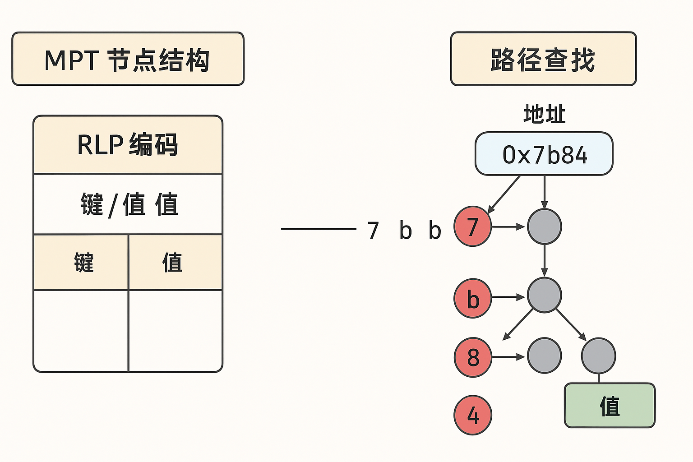
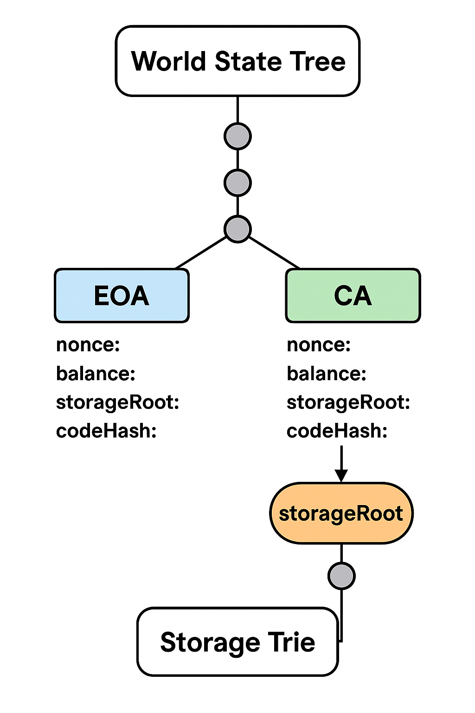
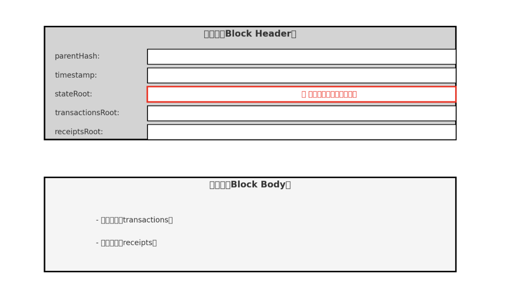

# 📘账户模型与状态存储

以太坊采用**状态账户模型（State-based Account Model）**，而非比特币的 UTXO 模型。本文将深入剖析账户的分类、数据结构、状态存储方式，以及底层 Merkle Patricia Trie 的工作原理，为理解智能合约的执行逻辑打下基础。

## ✦ 1. 为什么以太坊不用 UTXO？

比特币使用的是 **UTXO（Unspent Transaction Output）模型**：

- 每一笔交易消耗一组输入，生成一组输出
- 状态不可变、追溯性强、适合转账
- 不支持全局变量与复杂状态逻辑

但以太坊的目标是成为**通用计算平台**，需要能够：

- 追踪变量的历史状态
- 支持链上存储的读写变更
- 维护全球共享状态

因此，以太坊选择了更像“账户账本”的**状态账户模型**（每个账户有状态，状态可变）。

---

## ✦ 2. 以太坊账户分类：EOA vs 合约账户

| 类型 | 名称 | 控制方式 | 是否含代码 | 是否可主动发交易 |
| --- | --- | --- | --- | --- |
| **EOA** | 外部账户（Externally Owned Account） | 私钥签名控制 | 否 | ✅ 可以发起交易 |
| **CA** | 合约账户（Contract Account） | 被合约逻辑调用 | 是 | ❌ 只能被动响应调用 |

每个账户都由一个 **20 字节**的地址标识，其生成方式如下

- EOA：由公钥哈希生成（`address = last20bytes(keccak256(pubkey))`）
- CA：由创建者地址和 nonce 哈希生成（`address = keccak256(rlp(sender, nonce))`）

> 📌 合约账户无法主动发交易，但可以在被调用时再发起内部调用。
>
---

## ✦ 3. 账户结构：以太坊状态的核心单元

每个账户在**状态树**中以键值对形式存储，包含以下核心字段：

```json
{
  "nonce": uint,       // 发起交易的计数器（防重放）
  "balance": uint,     // 当前余额（单位：wei）
  "storageRoot": hash, // 合约状态变量存储的根哈希
  "codeHash": hash     // 合约代码哈希（或空）
}
```

- 对于 EOA，`storageRoot` 与 `codeHash` 为空
- 对于CA，`storageRoot` 指向其持久化变量存储， `codeHash` 存储 runtime bytecode 的哈希

---

## ✦ 4. 存储结构类型：Merkle Patricia Trie（MPT）

以太坊采用**Merkle Patricia Trie**，一种混合结构，用于确保状态**可验证、压缩、高效查找**。

- ✅ **Merkle Tree**：通过哈希保证数据不可篡改
- ✅ **Patricia Trie**：前缀压缩，提高键值检索效率
- ✅ **RLP 编码**：节点序列化，节省存储空间



## ✦ 5. 状态树：World State Trie (MPT 结构)

以太坊将**所有账户的状态信息**（包括 EOA 和合约账户）存储在一棵名为 **世界状态树（World State Tree）** 的结构中。

这棵树是基于 **Merkle Patricia Trie（MPT）** 构建的，用于：

- 以**哈希结构**确保状态不可篡改（Merkle 性）
- 以**前缀路径压缩**提高键值检索效率（Patricia 性）
- 以**RLP 编码**优化节点存储（序列化效率）



### stateRoot

- 每一个区块的 **区块头（Block Header）** 中包含一个字段：`stateRoot`
- `stateRoot` 是当前世界状态树的根哈希
- 它代表着**当前链上所有账户状态的加密快照**
- 每次交易或合约执行导致状态变更，都会更新对应的 Merkle Trie 分支，并**重新计算出新的 stateRoot，**写入当前区块头的 `stateRoot`



---

## ✦ 5. 合约存储树：Storage Trie（MPT结构）

在以太坊中，每个**合约账户都拥有一棵独立的存储树**，即 **Storage Trie**，用于保存该合约的状态变量（如 `uint x`、`mapping`、`array` 等）。

主状态树（World State Tree）并不直接存储这些变量本身，而是通过合约账户中的 `storageRoot` 字段，**引用这棵合约自己的存储树的根哈希**。

```text
World State Tree（主状态树）
│
├── 0xaaa...123 （EOA） → { balance, nonce, ... }
├── 0xbbc...456 （CA）  → {
│       storageRoot → ⬅️ ⬇️ Storage Trie（该合约状态变量）
│       codeHash
│   }
├── 0xcde...789 （CA） → {
        storageRoot → ⬅️ ⬇️ 另一棵 Storage Trie
        ...
    }
...
```

📌 每当该合约中的变量被修改，对应的 Storage Trie 分支会发生变化，并最终更新它的根哈希 `storageRoot`，再同步写入世界状态树。

> 📌 每个合约的状态变化都只影响自己的 Storage Trie，而不会影响其它账户。
>

### 🔐 存储 Trie 的键值结构

在合约存储中，变量的存储以**键值对**形式组织：

```tsx
storage[keccak256(slot)] = encoded_value
```

- `slot` 是变量的存储位置编号（按声明顺序，从 0 开始）
- 对于复杂结构如 `mapping(address => uint)`，键的计算方式为：

```scss
keccak256(packed(key_address . slot_index))
```

---

### 📦 每个合约一个 Trie：是的

你可以理解为：

> 主状态树是“入口目录”，每个合约账户挂载一份独立的“变量仓库”（Trie 子树）
>

这意味着：

- 全网有多少个合约账户，就有多少个对应的 Storage Trie
- 每棵 Trie 结构独立，互不干扰
- 所有 Trie 的根哈希被集中挂载在主状态树的不同分支节点中（按账户地址划分）

---

### 🧊 存储膨胀的现实问题

- 主状态树会随**账户数量增加而增大**（尤其是高交互账户）
- 每个活跃合约的 Storage Trie 也可能持续增长（如 AMM、DAO 合约）
- 导致节点同步变慢、存储成本提升
- 对策包括：状态租赁（State Rent）、清除机制（Self Destruct）、EIP 提案优化等

---

## ✦6. 状态更新的执行流程

1. 用户发起交易（TX），调用合约
2. EVM 执行合约逻辑，读取/修改状态变量
3. 存储变更写入合约的存储 Trie
4. 更新世界状态树的节点
5. 计算新的 `stateRoot`，存入当前区块头

此过程对每个节点都是可验证的，确保链上状态一致。状态更新的完整路径如下：

```text
交易发起（TX） → 调用合约 → 修改变量 → 更新合约存储树 → 更新状态树 → 更新区块头 stateRoot
```

---

## ✅ 小结

以太坊的账户模型是智能合约生态系统的基石。

通过划分 EOA 和 CA、使用哈希安全的 MPT 存储全局状态，以及为每个合约单独维护一棵 Storage Trie，以太坊实现了可追踪、可验证、可复用的全球状态架构。

---

## 🔄 导航

> ⬅️ 上一篇：[以太坊的定位与架构设计原则](./02_ethereum_intro.md)
> ⬅️ 下一篇：[交易机制与 Gas 原理](./04_transactions_and_gas.md)
>

📚 作者：Henry

👨‍💻 受众：Web3 开发者 / 区块链学习者
