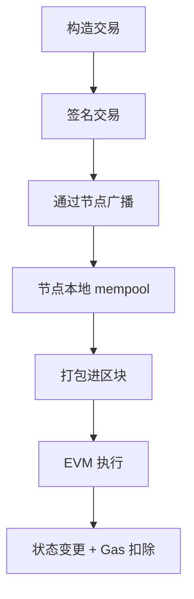

# 📘交易机制与 Gas 原理

以太坊的每一次状态更新背后，都离不开“**交易**”的驱动。本文将系统解析以太坊交易的构造、生命周期和执行机制，并深入剖析 **Gas 的作用、计费模型与 EIP-1559 升级影响**。掌握交易与 Gas 的核心机制，是开发高性能合约与优化用户体验的基础。

##

## ✦ 1. 一切皆交易：状态更新的起点

在以太坊中，**任何状态的改变，皆源自一笔交易**。无论是：

- 转账 ETH
- 部署合约
- 调用合约函数

本质上都由一笔发起自 **EOA（外部账户）** 的交易完成。交易是 Ethereum 状态机的驱动器，通过它触发 EVM 执行、修改状态、扣除 Gas 并最终上链。

---

## ✦ 2. 交易数据结构详解

一笔交易，是一个结构明确的字节序列（RLP 编码），其字段如下：

```tsx
interface Transaction {
  nonce: number;               // 防止重放的计数器
  gasLimit: number;            // 可消耗的最大 Gas
  maxFeePerGas?: bigint;       // 用户愿意支付的最大单价（EIP-1559）
  maxPriorityFeePerGas?: bigint; // 给出块者的小费
  to: string | null;           // 接收地址，null 表示部署合约
  value: bigint;               // ETH 转账金额
  data: bytes;                 // 合约调用或部署代码
  v, r, s: bytes;              // 签名字段（确定交易合法性）
}
```

- 普通转账：`to` 为目标地址，`data` 为空；
- 合约调用：`data` 编码为 `functionSelector + 参数`;
- 部署合约：`to = null`，`data` 是创建字节码（含 constructor）。

---

## ✦3. 交易的生命周期



交易的生命周期包含以下步骤：

| 阶段 | 描述 |
| --- | --- |
| 1️⃣ 构造交易 | 用户端构建交易结构并签名 |
| 2️⃣ 广播网络 | 节点将交易转发至 P2P 网络 |
| 3️⃣ Mempool | 节点暂存所有待打包交易 |
| 4️⃣ 打包进区块 | 验证者选择交易排序并打包 |
| 5️⃣ EVM 执行 | 调用函数、更新状态、计算 Gas |
| 6️⃣ 状态变更 | 存储更新 & 扣除账户余额 |

---

## ✦ 4. Gas 本质：以太坊的燃料计费系统

**Gas 是以太坊中衡量“计算与存储成本”的单位。**

每条 opcode（EVM 指令）都对应固定的 Gas 消耗。交易发起人需：

- 设置 `gasLimit`（最多愿意消耗多少 gas）
- 设置 `maxFeePerGas`（可接受的最高 gas 单价）
- 设置 `maxPriorityFeePerGas`（给验证者的小费）

系统执行时将按实际消耗扣除费用，多出的部分退还。

📌 若 Gas 不足，则触发 **Out of Gas 错误**，状态回滚，gas 不返还。

---

## ✦ 5. EIP-1559：现代 Fee 模型

伦敦升级后，以太坊采用了更公平的费用市场：

| 字段 | 含义 |
| --- | --- |
| `baseFee` | 网络自动调整的基础费用（按区块拥堵浮动） |
| `priorityFee` | 用户设定的小费 |
| `maxFee` | 用户愿意支付的最大 gas 单价 |

交易执行成本 = **gasUsed** × (`baseFee + priorityFee`)

其中：

- gasUsed：实际使用的 gas 数量
- `baseFee` 被直接销毁，构建 ETH 的通缩属性；
- `priorityFee` 给出块验证者作为激励。
- `baseFee + priorityFee` 是每单位gas 的价格

📈 提升了费用预测性，同时减轻了抢跑和 Gas 战。

### 🔍 更具体地拆开看

| 名称 | 意义 | 公式或含义 | 是否由用户支付 | 去向 |
| --- | --- | --- | --- | --- |
| **gasLimit** | 你愿意为这笔交易最多提供多少 gas | 类似预授权额度 | 否（未用部分退还） | 无 |
| **gasUsed** | 实际执行中消耗了多少 gas | opcode、storage、调用的实际计算资源 | ✅ 是 | 用于计算费用 |
| **gasPrice**（旧） / `baseFee + priorityFee`（新） | 每单位 gas 的价格 | 你愿意为每单位 gas 支付多少 ETH | ✅ 是 | 分为销毁 + 小费 |
| **执行成本 Execution Cost** | 最终这笔交易到底花了多少钱 | `gasUsed × (baseFee + priorityFee)` | ✅ 是 | 销毁 + 给验证者 |

### ✅ 举个例子（EIP-1559 之后）

你设置了：

- `gasLimit = 100,000`
- 交易实际只用了 `gasUsed = 41,000`
- 当前 `baseFee = 20 gwei`，你愿意付 `priorityFee = 2 gwei`

那么：

- **执行成本** = `41,000 × (20 + 2)` = `902,000 gwei` = `0.000902 ETH`
- 其中：
  - `41,000 × 20` = 被销毁（baseFee 部分）
  - `41,000 × 2` = 给出块者的小费（priorityFee）
- 未用的 `59,000` gas 会全额退还（gasLimit - gasUsed）

---

## ✦ 6. 合约执行中的 Gas 关键点

智能合约执行过程中的几个高 Gas 操作：

| 操作 | 描述 | 消耗情况 |
| --- | --- | --- |
| `SSTORE` | 修改存储状态 | 非常昂贵，首次写入或清零最贵 |
| `CALL` | 合约调用 | 每层调用会叠加开销 |
| `LOG` | 发事件日志 | 消耗 Gas（与 topic 数量相关） |
| `CREATE` | 创建合约 | 含部署逻辑与新地址生成 |

💡 最佳实践：

- 避免循环嵌套合约调用；
- 尽量减少存储写操作；
- 合理拆分合约结构；
- 使用 `view/pure` 查询逻辑避免 gas 费用。

---

## ✅ 小结

> 一笔交易，背后是一次完整的 EVM 状态变更执行；
>
> 一滴 gas，代表着链上计算资源的使用成本。
>

理解交易结构与 Gas 模型，是掌握以太坊执行逻辑、提升合约性能的第一步。

---

## 🔄 导航

> ⬅️ 上一篇：[账户模型与状态存储机制](./03_account_model.md)
>
> ⬅️ 下一篇：[EVM 工作原理与执行流程](./05_evm_execution.md)
>

📚 作者：Henry

👨‍💻 受众：Web3 开发者 / 区块链学习者
