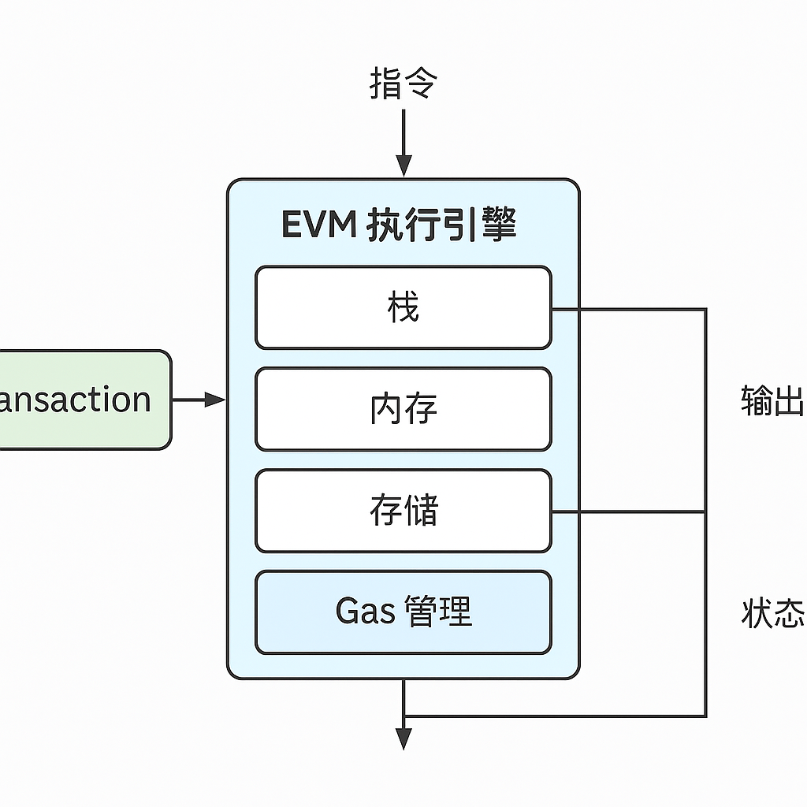
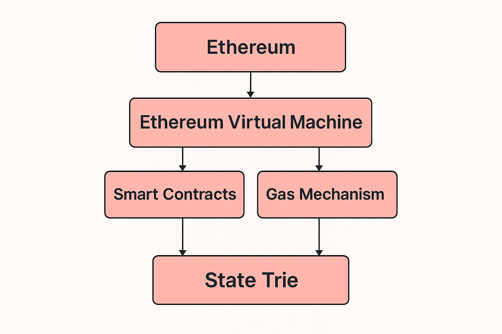
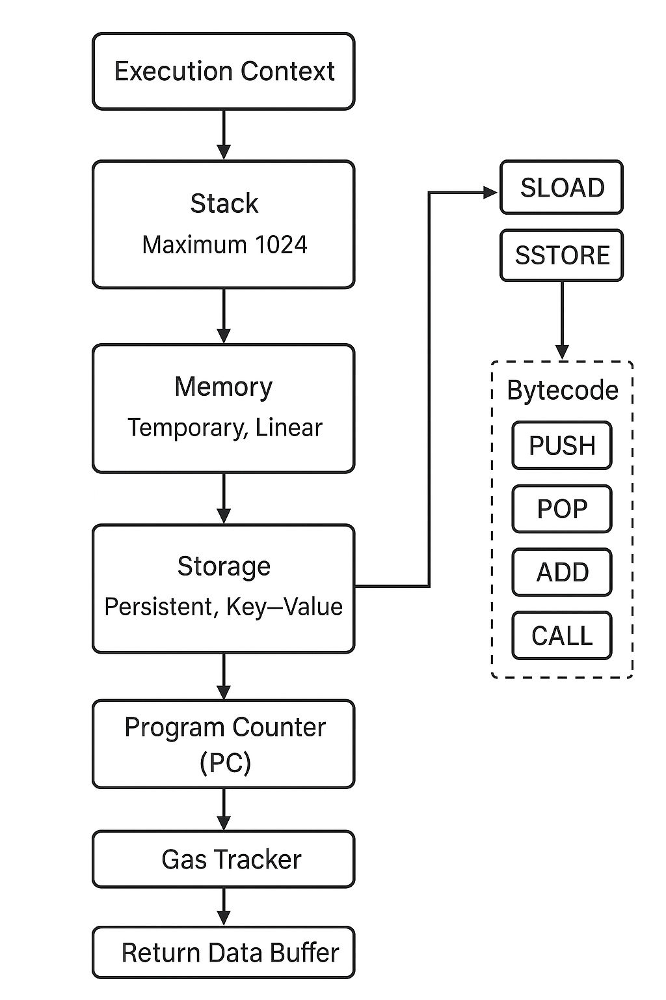

# 📘EVM 工作原理与执行流程

以太坊虚拟机（EVM）是智能合约执行的“心脏”，其设计体现了 Web3 对**安全性、确定性与去中心化计算**的极致追求。它通过**栈式模型、内存分区、Gas 管控与调用帧机制**，支撑了整个智能合约生态。

> 📌 本文将系统解析：EVM 架构、执行流程、指令集、Gas 扣费与合约调用的底层逻辑。
>

## ✦ 1. 什么是 EVM？

EVM（Ethereum Virtual Machine）是每个以太坊节点内运行的**一致性虚拟机环境**：

- 📦 沙箱模型：与真实主机隔离，仅操作合约自身状态
- 📜 字节码执行：由 Solidity / Vyper 等语言编译而来
- 🌐 全网共识：任一节点执行同一交易，结果必然一致

**EVM 实例不是共享的，但状态是共识的**。

> ✅ 可理解为：每个节点都有一台“以太坊 CPU”，运行完全相同的程序，确保链上状态同步更新。
>

---

## ✦ 2. EVM 的执行架构

EVM 是**基于栈的执行引擎**，每次交易创建一个“上下文执行环境”并执行对应字节码指令：

| 模块 | 描述 |
| --- | --- |
| 📦 Stack | 最大深度 1024，仅存放临时数据，支持 PUSH / POP 等指令 |
| 🧠 Memory | 临时内存，按字节扩展，仅在一次调用期间有效 |
| 🗃 Storage | 持久化存储，每个合约唯一，存储状态变量 |
| ⏱ Program Counter (PC) | 当前执行到的指令位置 |
| ⛽ Gas Tracker | 追踪剩余 gas，若为 0 即中断执行 |
| 📤 Return Data Buffer | 执行`CALL`或`DELEGATECALL`后的返回值，用于向上传递结果 |

---

## ✦ 3. EVM 操作码（Opcodes）

EVM 使用一套简洁的 1 字节操作码系统，共约 140+ 条，分为：

| 类型 | 示例 | 功能 |
| --- | --- | --- |
| 栈操作 | `PUSH`, `POP`, `DUP`, `SWAP` | 栈顶操作 |
| 算术 | `ADD`, `SUB`, `MUL`, `DIV` | 整数计算 |
| 存储 | `SLOAD`, `SSTORE` | 读取 / 写入状态变量 |
| 调用 | `CALL`, `DELEGATECALL` | 合约调用 |
| 控制 | `JUMP`, `REVERT`, `STOP` | 执行流控制 |
| 日志 | `LOG0` - `LOG4` | 事件触发 |

> ⚠️ 注意：部分指令如 SSTORE 消耗极高的 gas，应谨慎使用。
>

---

## ✦ 4. EVM 执行流程（Call Frame）

每次合约调用，EVM 会创建一个**新的调用帧（Call Frame）**，就像函数调用栈帧：

- 当前合约地址
- 调用者地址（`msg.sender`）
- ETH 数量（`msg.value`）
- 调用参数（`msg.data`）
- Gas 限额

> 🌊 每次 CALL、DELEGATECALL 都会生成一个帧，形成调用链；最大深度限制为 1024。
>

---

## ✦ 5. Gas 扣费机制

每条 EVM 指令在执行前都会**预扣 gas**，执行失败也不会退还：

| 情况 | 是否扣除 Gas | 状态变更 |
| --- | --- | --- |
| 正常执行 | ✅ | ✅ |
| REVERT | ✅ 部分扣除 | ❌ 回滚 |
| OUT OF GAS / INVALID | ✅ 全部扣除 | ❌ 回滚 |

> ⛽ 如果调用其他合约，还需为子调用分配 gas，否则可能提前耗尽。
>

📌 合约执行前应设置合理 `gasLimit`，避免被中断。

---

## ✦ 6. 合约返回与错误处理

EVM 支持三种返回方式：

| 情况 | 指令 | Gas 处理 | 是否回滚 |
| --- | --- | --- | --- |
| 正常返回 | `RETURN` | 剩余 gas 返还 | 否 |
| 显式失败 | `REVERT` | 剩余 gas 返还 | 是 |
| 异常终止 | `OUT OF GAS`, `INVALID` | 全部扣除 | 是 |

- `REVERT` 是推荐的失败处理方式，能返回错误信息
- `INVALID` 多由非法操作或字节码错误导致，直接终止执行

---

## ✦ 7. 合约间调用指令区别

合约调用通过不同指令实现不同语义：

| 指令 | msg.sender | 被调用合约使用哪个Storage | 是否可转账 | 应用场景 |
| --- | --- | --- | --- | --- |
| `CALL` | 当前合约 | 被调合约 | ✅ | 常规调用 |
| `DELEGATECALL` | 外部调用者 | 当前合约 | ❌ | Proxy 模式 |
| `STATICCALL` | 当前合约 | 被调合约 | ❌ | 只读调用 |

> 🔁 DELEGATECALL 会保留调用上下文，常用于合约代理 / 升级。
>

---

## ✅ 小结

EVM 并不仅仅是“执行代码”，而是一个**安全沙箱 + 有限状态机 + 资源定价系统**的复杂组合。

> 理解 EVM，意味着你理解了 Solidity 背后的运行模型，合约的执行边界，以及链上状态的每一次变更路径。
>

---

## 🔄 导航

> ⬅️ 上一篇：[交易机制与 Gas 原理](./04_transactions_and_gas.md)
>
> ⬅️ 下一篇：[以太坊的存储结构与 Merkle Trie](./06_storage_and_mpt.md)
>

📚 作者：Henry

👨‍💻 受众：Web3 开发者 / 区块链学习者
