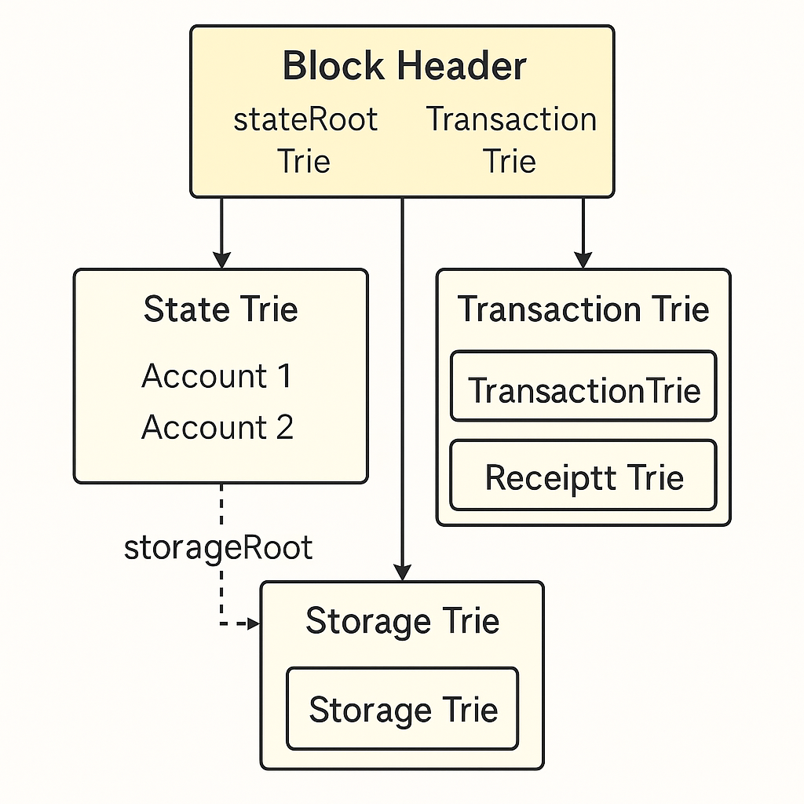
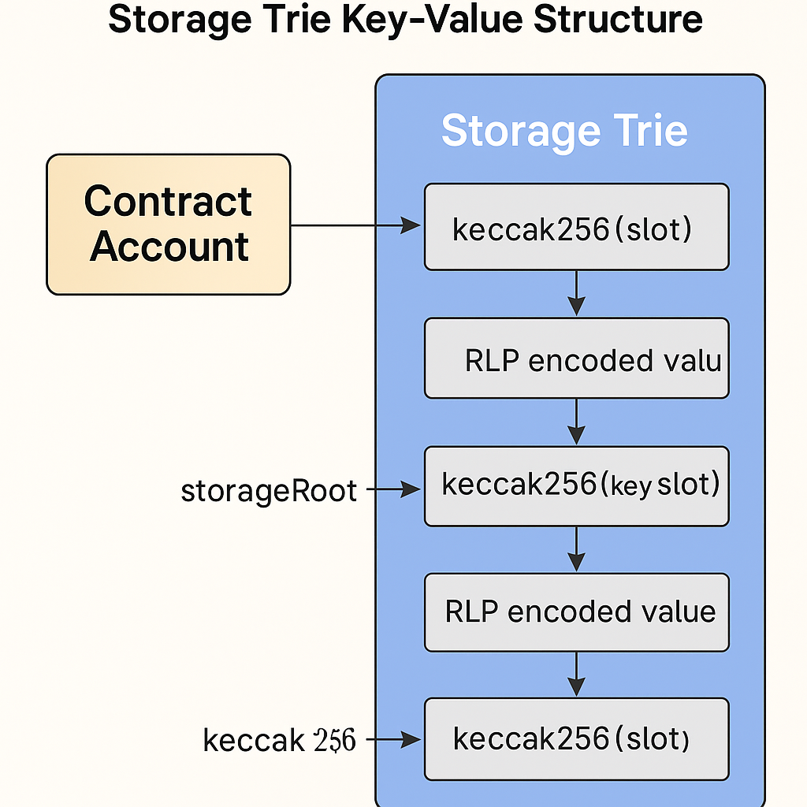

# 📘以太坊的存储结构与 Merkle Trie（默克尔前缀树）

以太坊并未使用传统数据库，而是构建出一套具备**可验证性、安全性与高效索引能力**的底层数据结构 ——**Merkle Patricia Trie（MPT）**。

它支撑了账户状态、合约变量、交易记录的存储机制，也是轻节点验证和跨链证明的基础。

## ✦ 1. 为什么以太坊需要特殊的存储结构？

以太坊要实现的是一个**全球状态同步的可信网络**，这对存储系统提出以下挑战：

- 🔁 支持频繁状态更新（账户余额、合约变量等）
- 🔐 保证每次状态变更都可验证、防篡改
- 🛰 兼容轻节点（无需全量数据，也能验证状态）

因此，以太坊引入了基于哈希验证机制的 **Merkle Trie（默克尔树）结构**，它天然支持**状态快照、部分证明和去中心化校验**，比传统 SQL/NoSQL 更适合区块链系统。

---

## 2. Merkle Patricia Trie 是什么？

**MPT** 是一种结合多种数据结构特性的 Trie 变种：

| 成员结构 | 功能 | 在 MPT 中的体现 |
| --- | --- | --- |
| 🔗 **Merkle Tree** | 哈希递归构建整棵树，支持防篡改和路径验证 | 每个节点哈希影响 `rootHash`，用于状态证明 |
| 🔍 **Radix Tree**（前缀树） | 支持快速字符串查找（基于共享前缀） | 地址路径被分割为十六进制 nibbles |
| 🧬 **Patricia Tree** | 对路径进行压缩，节省冗余节点 | 支持路径压缩，减少 Trie 深度和存储开销 |

📌 MPT 是一种**加密验证 + 快速路径匹配 + 节点压缩优化**结合体，专为以太坊状态树高频读写需求设计的。



> ✅ 核心理念：**每个状态的更新都会映射到一个新的根哈希(roothash)，作为该状态快照的唯一标识。**
>

---

## ✦ 3. RLP 编码：以太坊的通用序列化格式

**RLP（Recursive Length Prefix, 递归长度前缀编码）** 是以太坊专用的数据编码格式，专为**结构化数据的压缩与存储**设计：

### ✅ RLP 特点

- 支持任意嵌套（数组 / 对象）
- 编码短小、结构明确
- 适用于存储层与网络传输

### ✍️ 示例

- 字符串 `"cat"` → `0x83636174`
  - `0x83` 是**长度前缀**（表示后面有3字节）
  - `636174` 是 `cat` 的 ASCII 编码
- 列表 `["dog", "cat"]` → `0xc883646f6783636174`
  - `0x83 646f67` 是 "dog"
  - `0x83 636174` 是 "cat"
  - `0xc8` 是整个列表的前缀（总长度为8字节）

📌 RLP 是 MPT 的配套机制，所有节点数据都经 RLP 编码后写入 Trie。

### RLP 应用场景

| 用途场景 | RLP 编码内容 |
| --- | --- |
| 🧾 状态树节点 | 账户结构、变量值 |
| ⛓ 交易信息 | nonce、to、data 等 |
| 🧱 区块头字段 | timestamp、stateRoot 等 |

---

## ✦ 4. 三棵 Trie 的作用划分

以太坊全网状态由三类 Merkle Trie 共同构建：

| Trie 类型 | 描述 | 根哈希存储位置 |
| --- | --- | --- |
| 📘 State Trie | 账户状态（ETH、nonce、合约状态） | 区块头 `stateRoot` |
| 📦 Storage Trie | 每个合约的变量存储（slot -> value） | 每个合约账户 `storageRoot` |
| 🧾 Transaction Trie | 当前区块所有交易的内容 | 区块头 `transactionsRoot` |


---

## ✦ 5. State Trie：全球账户状态快照

State Trie 的 key 是账户地址（经过 keccak256 哈希），value 是 RLP 编码的账户对象：

```json
{
  "nonce": 3,
  "balance": 150000,
  "storageRoot": "0x...",
  "codeHash": "0x..."
}
```

每次执行交易或合约调用，都会修改对应账户节点，引发 root hash 的更新。

---

## ✦ 6. Storage Trie：合约存储机制

每个合约账户持有**独立**的 Storage Trie：

- 键为：`keccak256(slot_index)`（slot 为状态变量位置）
- 值为：变量的值，经 RLP 编码

复杂结构如 `mapping(address => uint)`：

```solidity
mapping(address => uint) balance;
```

其 key 为：`keccak256(concat(slot, key_address))`



---

## ✦ 7. Transaction / Receipt Trie

每个区块额外维护两棵 Trie：

| Trie | 内容 | 根哈希字段 |
| --- | --- | --- |
| 🧾 Transaction Trie | 本区块所有交易（RLP 编码） | `transactionsRoot` |
| 📄 Receipt Trie | 每笔交易执行结果（gasUsed, logs） | `receiptsRoot` |

这些结构为轻节点、跨链桥等提供了**可验证数据来源**。

---

## ✦ 8. Merkle Trie 的安全价值

| 特性 | 描述 |
| --- | --- |
| ✅ 可验证性 | 支持 Merkle 证明，轻节点可验证某账户或变量存在性 |
| ✅ 防篡改性 | 状态变更后 root hash 必变，不可伪造 |
| ✅ 最小信任同步 | 轻节点只需同步 root 和部分路径即可 |

---

## ✅ 小结

以太坊通过 Merkle Patricia Trie + RLP 编码，建立了一套**安全性与可验证性兼具的全球状态架构**。

> 理解 MPT，不仅有助于合约调试和存储优化，更是深入理解 Layer2、ZK 证明与跨链桥设计的基础能力
>

---

## 🔄 导航

> ⬅️ 上一篇：[EVM 工作原理与执行流程](./05_evm_execution.md)
>
>
> ➡️ 下一篇：[合约部署与调用流程](./07_contract_lifecycle.md)
>

📚 作者：Henry

👨‍💻 受众：Web3 开发者 / 区块链学习者
