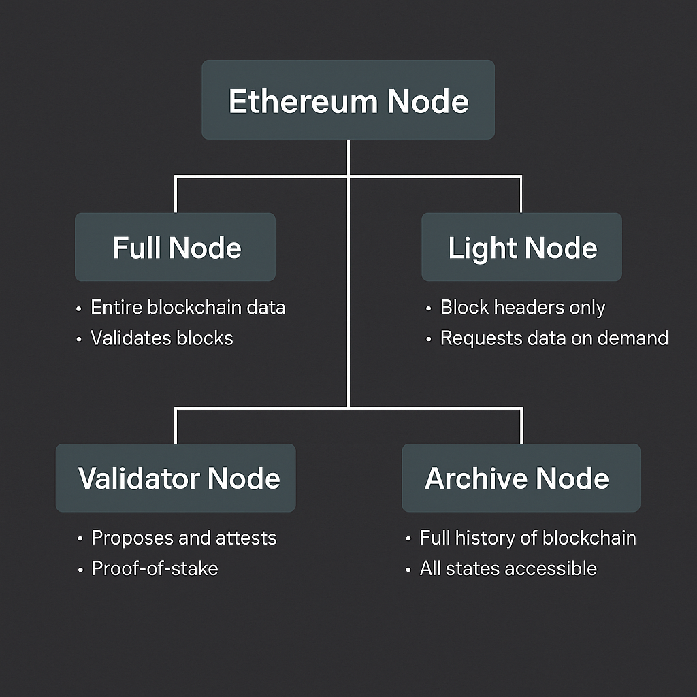
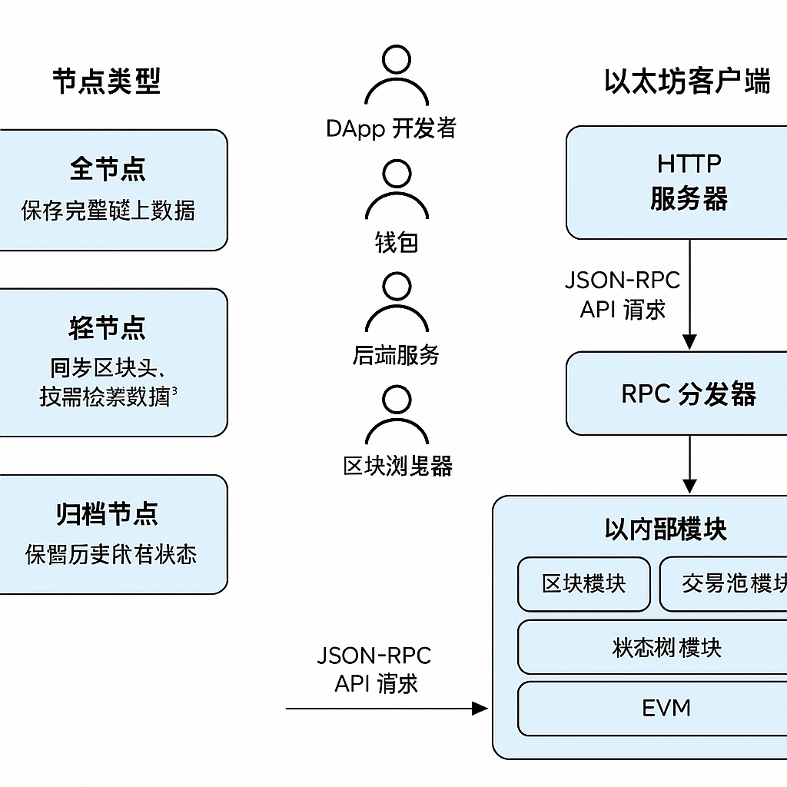
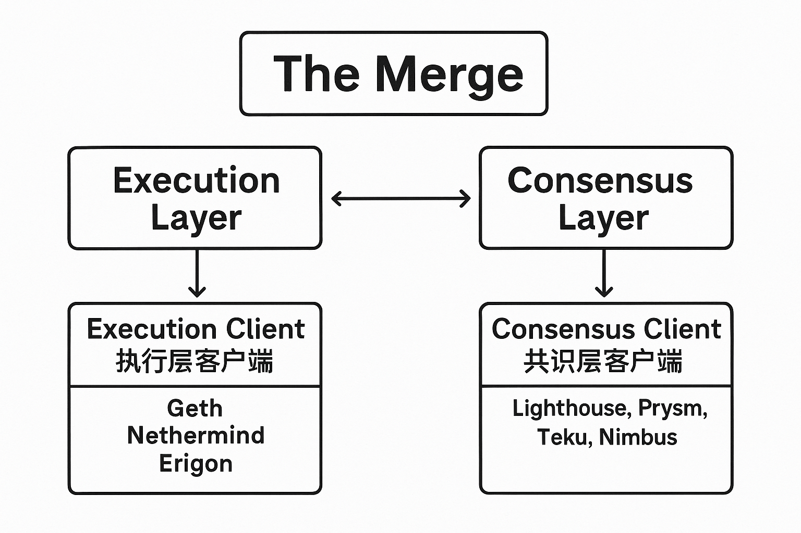

# 📘节点类型、客户端结构与 RPC 通信机制

节点是连接开发者与以太坊链上世界的“桥梁”，而 JSON-RPC 是这座桥的标准通信协议。

本文将从节点类型、客户端组成、同步方式、RPC 接口原理等多个角度，系统剖析以太坊节点的运行机制与对外服务能力。

## ✦ 1. 什么是以太坊节点？

以太坊节点是一台**运行以太坊客户端软件**（如 Geth、Nethermind、Erigon 等）的计算机。它具备以下核心功能：

- 🧠 同步并维护链上数据（区块、状态、交易）
- ✅ 验证新区块与交易的合法性
- 📣 广播新的交易或区块到全网
- 🔌 向外暴露开发接口（如 JSON-RPC）

📌 节点是网络的“细胞”，每个节点都对整个以太坊状态负部分责任。

---

## ✦ 2. 节点、客户端与执行层 / 共识层的关系

| 概念 | 定义 | 举例 |
| --- | --- | --- |
| 节点 | 运行客户端程序的主机 | 一台服务器 / 云主机 |
| 客户端 | 实现以太坊协议的软件 | Geth、Nethermind、Erigon |
| 执行层 | 执行交易与合约逻辑（EVM） | Geth（执行交易） |
| 共识层 | 维护 PoS 共识与出块流程 | Lighthouse、Prysm、Teku |

> 自 PoS 起，一个**完整的以太坊节点**必须同时运行：
> ✅ **执行层客户端** + ✅ **共识层客户端**

### ✅ “完整节点” ≠ 节点类型中的某一类，而是结构上的一组组合

> 在 PoS（以太坊合并后）语境下：
> **一个“完整的以太坊节点” = 执行层客户端 + 共识层客户端 + 同步链上状态 + 验证区块**

### 🧩 完整节点与节点类型的关系

几种“节点类型”是**运行模式或数据存储方式**，而“完整节点”是**结构要求**：

| 节点类型 | 是否等于“完整节点” | 是否要求执行+共识 |
| --- | --- | --- |
| 全节点 | ✅ 是（满足最小要求） | ✅ 必须 |
| 归档节点 | ✅ 是（包含更多历史数据） | ✅ 必须 |
| 轻节点 | ❌ 否（不验证全部状态） | ❌ 通常只连接执行或共识层 |
| 验证者节点 | ✅ 是（并承担出块职责） | ✅ 必须，并需质押 ETH |

---

## ✦ 3. 节点类型分类

| 类型 | 说明 | 用途 |
| --- | --- | --- |
| 全节点 | 保留当前所有状态，验证新区块合法性 | DApp 后端、数据校验 |
| 轻节点 | 只同步区块头，按需查询数据 | 钱包、移动设备 |
| 归档节点 | 存储每个历史状态快照 | 区块浏览器、分析平台 |
| 验证者节点 | PoS 出块与验证（含质押） | Staking、Lido 节点 |



📌 客户端 ≠ 节点，只有程序**运行起来并参与网络同步**，才是真正节点。

> 节点是一种“状态”，客户端是一种“工具”
>

---

## ✦ 4. 节点同步模式详解

| 模式 | 原理 | 数据体积 | 适合场景 |
| --- | --- | --- | --- |
| Full | 验证全部区块和状态变更 | 中 | 完整验证 |
| Fast | 验证近状态，跳过旧状态回溯 | 小 | 常见默认 |
| Snap | 使用状态快照快速同步 State Trie | 更小 | 主流默认模式 |
| Light | 仅同步区块头，按需查数据 | 极小 | 轻钱包、移动端 |

> 🌟  开发者推荐使用：**Snap 模式 + 全节点**，可在几小时内完成同步。
>

---

## ✦ 5. 什么是 JSON-RPC？

**JSON-RPC** 是以太坊节点对外提供的标准接口协议，支持：

- 前端读取链上状态
- 广播交易
- 查询区块 / 交易 / 合约
- 与钱包通信

每个 JSON-RPC 请求格式：

```json
{
  "jsonrpc": "2.0",
  "method": "eth_blockNumber",
  "params": [],
  "id": 1
}
```

📌 可通过 HTTP / WebSocket 访问，支持跨语言客户端。

---

## ✦ 6. 常用 JSON-RPC 方法速览

| 方法 | 说明 |
| --- | --- |
| `eth_blockNumber` | 获取最新区块高度 |
| `eth_getBlockByNumber` | 获取指定区块内容 |
| `eth_getBalance` | 查询地址余额 |
| `eth_call` | 只读调用合约方法 |
| `eth_sendRawTransaction` | 广播签名交易 |
| `eth_getTransactionByHash` | 查询交易信息 |
| `eth_chainId` | 返回当前链 ID |

---

## ✦ 7. 如何在前端调用节点 RPC？

前端常通过库封装 RPC 请求，如 `ethers.js`, `viem`, `wagmi`：

```tsx
// ethers.js 示例
const provider = new ethers.JsonRpcProvider("https://mainnet.infura.io/v3/...");
const balance = await provider.getBalance("0xabc...");
```

或者直接通过钱包注入：

```jsx
await window.ethereum.request({
  method: 'eth_sendTransaction',
  params: [tx]
});
```

---

## ✦ 8. RPC 接口与 EVM 内部的连接机制

每个 JSON-RPC 请求，都会被节点软件内部的**模块**路由并执行：

```text
用户请求  →  HTTP / WS 服务层
         ↓
      RPC 路由器（Dispatcher）
         ↓
      模块系统（EVM / 区块 / 状态 / 交易池）
         ↓
      返回响应数据（如余额、交易状态等）
```

📌 例如 `eth_getBalance` 会触发 StateManager 读取账户状态树。



---

## ✦ 9. 如何搭建本地节点？

以 Geth 为例，仅需一条命令：

```bash
geth --syncmode snap \
     --http \
     --http.api eth,net,web3 \
     --http.addr 0.0.0.0 \
     --http.port 8545
```

即可暴露 HTTP JSON-RPC 接口，可供前端直接接入本地链。

---

## ✦ 10. 执行层 vs 共识层：以太坊合并后的双客户端结构

自 The Merge（合并升级）后，以太坊将原本由单个客户端承担的功能拆分为两个独立层次：

| 层级 | 职责 | 客户端示例 |
| --- | --- | --- |
| **执行层** | 处理交易执行、EVM、状态更新、提供 RPC 接口 | Geth、Nethermind、Erigon |
| **共识层** | 运行 PoS 共识协议，管理验证者与出块顺序 | Lighthouse、Prysm、Teku、Nimbus |

它们通过标准化接口 **Engine API** 进行通信，实现职责解耦。



### 🧩 执行层特点

- 执行智能合约逻辑
- 管理状态树与交易池
- 对外提供 JSON-RPC 接口

### 🔐 共识层特点

- 选取出块者（验证者）
- 验证区块签名、维护最终性
- 驱动 PoS 协议运转

### 🔄 Engine API 的作用

- 共识层提议区块 → 请求执行层执行
- 执行层执行交易 → 返回状态结果
- 共识层完成签名 → 广播新区块

> ✅ 执行层 = “以太坊的逻辑大脑”
>
> ✅ 共识层 = “以太坊的协调者”
>
> 二者共同维护链上运行的完整性与安全性。
>

---

## ✅ 小结

理解以太坊节点是连接开发者与链上世界的桥梁，而 JSON-RPC 则是这座桥的通信协议。从节点分类、同步方式到 API 调用，掌握这些技术是成为高级 Web3 工程师的基础能力。

## 🔄 导航

> ⬅️ 上一篇：[合约部署与调用流程](./07_contract_lifecycle.md)
> ➡️ 下一篇：[Rollup 与未来扩展路线](./09_rollup_scaling.md)
>

📚 作者：Henry

👨‍💻 受众：Web3 开发者 / 区块链学习者
