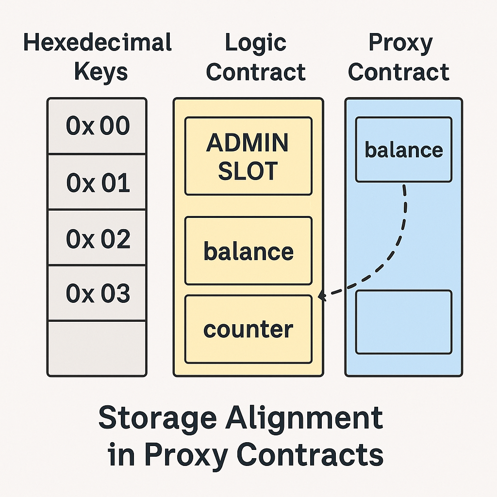

# 📘合约升级机制与 Proxy 模式

智能合约一经部署后代码不可变，这是保障链上安全性的重要特性。但现实中，大多数 Web3 项目需要随着协议演进、功能扩展而持续更新。为了在不丢失状态和地址的前提下迭代逻辑，**Proxy（代理）升级模式**逐渐成为智能合约工程的事实标准。

这篇文章将系统介绍合约为何需要升级、常见升级模式、Proxy 模式的执行原理、主流实现（Transparent、UUPS）、安全陷阱以及实际应用建议。

## ✦ 1. 为什么合约需要升级？

- 无法修复代码 Bug
- 难以引入新功能或治理逻辑
- 合约地址变更会导致用户资产与授权中断

> 📌 在 Web2 中升级部署是家常便饭，而 Web3 中则必须绕开“不可变”限制。
>

---

## ✦2. 合约升级方式概览

| 模式 | 说明 | 优缺点 |
| --- | --- | --- |
| 重新部署 | 部署新合约，通知用户切换地址 | 简单，但兼容性差（地址变动、状态丢失） |
| 数据迁移 | 携带旧数据部署新合约 | 易错，成本高 |
| 🔥Proxy 模式 | 保留地址与存储，仅升级逻辑合约 | 实现复杂，需谨慎设计 |

---

## ✦3. Proxy 模式的工作原理

Proxy 升级通过两个合约组合实现：

- 📌 **Proxy（代理合约）**：对外暴露地址，存储状态，负责将函数调用转发至逻辑合约。
- 📌 **Implementation（逻辑合约）**：存储纯逻辑代码，无状态。

### delegatecall 原理

调用者执行：

```solidity
(bool success, ) = impl.delegatecall(msg.data);
```

- 使用 `delegatecall` 调用逻辑合约
- 使用 Proxy 合约的上下文（`msg.sender` 和 `storage`）
- Proxy 合约中使用**固定槽**（如 EIP-1967）存储逻辑合约地址。

⚠️ 实际调用的函数体在 Logic 合约中，但读写的数据来自 Proxy 的存储区。

---

## ✦4. Proxy 合约结构图


- 用户（EOA）发起调用，请求发送到 **Proxy 合约地址**
- Proxy 合约内部不包含实际业务逻辑，仅持有存储，并使用 `delegatecall` 将请求转发至 逻辑 合约
- 逻辑合约中的函数在 Proxy 的上下文中执行，即：
  - 状态（storage）读取的是 Proxy 的数据
  - `msg.sender` 为调用 Proxy 的原始地址

> ✅ 关键机制：逻辑代码来自逻辑合约（**Implementation**），状态数据来自代理合约
>

---

## ✦5. 常见 Proxy 标准与对比

| 标准 | 特点 | 使用项目 |
| --- | --- | --- |
| Transparent Proxy | Proxy 只转发普通函数，upgrade 权限给 Admin | OpenZeppelin 默认 |
| UUPS Proxy ✅ | Upgrade 逻辑由 Logic 合约实现，更轻量 | OpenZeppelin（推荐） |
| Beacon Proxy | 多个 Proxy 使用同一 Beacon 指定实现 | Lido、RocketPool |

---

## ✦6.UUPS 模式详解（推荐）

UUPS（Universal Upgradeable Proxy Standard）是现代推荐的升级模式。

### ✅ 特点

- 升级逻辑放在 Logic 合约中（如 `upgradeTo()`）
- Proxy 合约本身更轻量
- 更适合 Gas 成本敏感的项目

### 示例代码

```solidity
contract MyLogic is UUPSUpgradeable, OwnableUpgradeable {
    uint256 public count;

    function initialize() public initializer {
        __Ownable_init();
    }

    function increment() public {
        count++;
    }

    function _authorizeUpgrade(address) internal override onlyOwner {}
}
```

---

## 7. Transparent vs UUPS 对比

| 特性 | Transparent Proxy | UUPS Proxy ✅ |
| --- | --- | --- |
| Upgrade 权限 | Proxy 管理 | Logic 自持 |
| 合约复杂度 | 多一层 Admin 管理 | 更轻量 |
| 安全风险 | 误用低 | 需小心授权升级函数 |
| 可组合性 | 较差 | 更适配模块化逻辑合约体系 |

---


| 对比项 | Transparent Proxy | UUPS Proxy |
| --- | --- | --- |
| 升级权限入口 | Proxy 合约中内置 `admin` 角色 | 逻辑合约实现 `_authorizeUpgrade()` |
| 权限边界 | Proxy 过滤函数（`if caller == admin`） | 由逻辑合约自行决定 |
| 灵活性 | 中规中矩，适合多人管理 | 更灵活，但必须小心实现 |
| 合约复杂度 | 多一层 Proxy Admin 管理逻辑 | Proxy 更轻，Logic 更强 |

图中左侧展示了 Transparent Proxy 如何区分用户与管理员调用，右侧展示 UUPS 模式通过 `upgradeTo()` 函数与权限修饰器控制访问升级逻辑。

> ✅ 建议开发者：低风险应用用 Transparent，熟练项目团队使用 UUPS
>

## 8. 升级中的常见陷阱与踩坑

| 问题 | 描述 | 后果 |
| --- | --- | --- |
| ❌ 存储冲突 | LogicV2 新增变量，slot 覆盖旧状态 | 状态混乱 |
| ❌ 初始化重复 | 忘记使用 `initializer` 修饰 | 可被攻击者初始化 |
| ❌ 构造函数中写逻辑 | 构造函数不会被 Proxy 调用 | 初始化逻辑无效 |
| ❌ 授权函数写错 | `_authorizeUpgrade()` 被开放 | 任何人可升级 |
| ❌ 使用 constructor 初始化 owner | 不会生效，应用 OwnableUpgradeable |  |

> 💡 推荐使用 OpenZeppelin 的 Upgrade 插件（如 @openzeppelin/hardhat-upgrades）生成脚手架代码，避免低级错误。
>

---

## 9. 存储对齐 & 升级兼容性

在升级过程中，**Logic 合约必须保持与 Proxy 合约存储布局完全一致**。



- Logic 合约中的字段声明必须保持顺序、类型不变
- 新增字段只能追加到末尾，不能插入中间或重排

例如：

```solidity
// V1
contract LogicV1 {
    uint256 public count;  // slot 0
}

// V2
contract LogicV2 {
    uint256 public count;       // slot 0 (继承)
    address public owner;       // slot 1 ✅ 新增字段
}
```

❌ 一旦发生 slot 覆盖（如 uint → address），将导致旧状态损坏或被攻击者利用。

### ✅ 小结

合约升级是链上协议可持续进化的根基。Proxy 模式虽带来灵活性，但也伴随着复杂度与安全风险。理解 delegatecall 的上下文传递、掌握存储对齐规则、使用标准库工具封装，是构建可升级、安全、高可维护合约的核心工程能

## 🔄 导航

> ⬅️ 上一篇：[Rollup 与未来扩展路线](./09_rollup_scaling.md)
> ➡️ 下一篇：待续
>

📚 作者：Henry

👨‍💻 受众：Web3 开发者 / 区块链学习者
