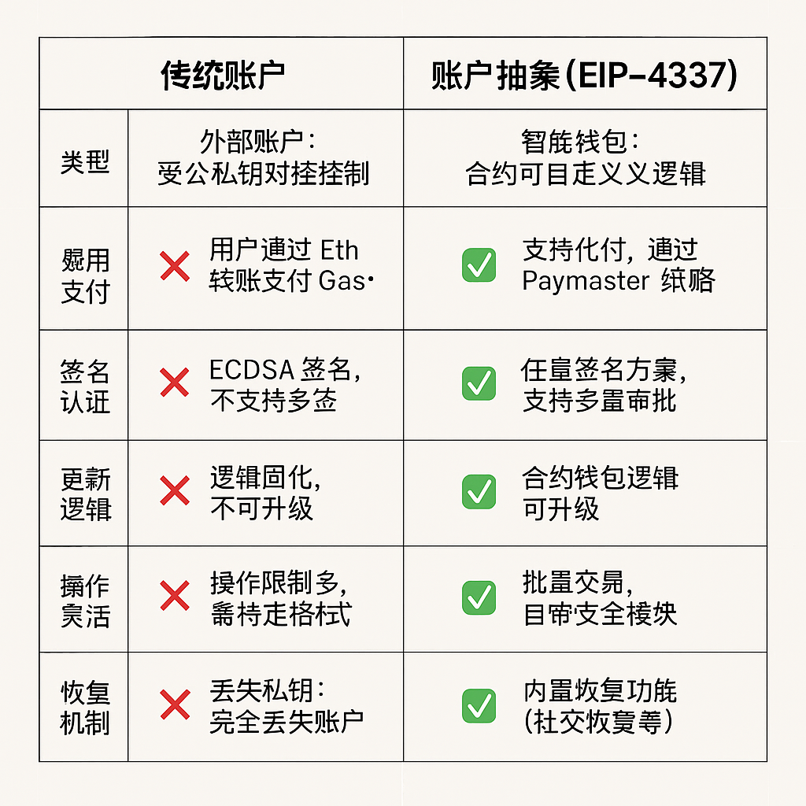

# 📘 账户抽象与智能账户

以太坊早期的账户模型将用户行为与密钥控制紧密耦合，限制了钱包的灵活性与可扩展性。**账户抽象（Account Abstraction, AA）**试图打破这一耦合，让合约账户像外部账户一样发起交易、管理资产、实现自定义逻辑。

本章将深入解析 AA 背后的动机、核心 EIP（特别是 EIP-4337）、核心组件（EntryPoint、UserOperation 等）与运行流程，并展示其对未来 Web3 用户体验、支付模型与安全性的深远影响。

---

## ✦ 1. 什么是账户抽象（Account Abstraction）？

账户抽象：**让合约账户也能像外部账户（EOA）一样自主发起交易，并定义自定义验证逻辑。**

传统以太坊账户模型：

| 类型 | 特点 | 限制 |
| --- | --- | --- |
| EOA（外部账户） | 私钥控制，直接发交易 | 不能自定义签名方式；易丢失私钥 |
| CA（合约账户） | 只能被动接收调用 | 无法主动发交易；签名依赖外部账户 |

账户抽象的目标是融合两者优点：

> ✅ 安全性 + ✅ 灵活性 + ✅ 主动性
>

---

## ✦ 2. 为什么需要AA？

### 🔒 安全性需求

- 私钥易丢失、被盗，缺乏恢复机制
- 多签、社交恢复等只能通过复杂合约实现

### 🌍 用户体验

- Gas 费用必须用 ETH 支付，不利于多链
- 无法实现自动化签名、钱包内自动支付

### 🧩 可组合性

- 无法构建统一的合约钱包标准，导致生态碎片化
- 钱包逻辑受限，无法自由升级

账户抽象通过合约账户发起交易与验证器模块，使这些能力成为可能。

---

## ✦ 3. 账户抽象的技术路径演化

| 路线 | 状态 | 特点 |
| --- | --- | --- |
| EIP-86 | 早期尝试 | 提议修改协议层，未采纳 |
| EIP-2938 | 协议层 AA | 新交易类型 + opcode 扩展，复杂度高 |
| ✅ EIP-4337 | 应用层 AA | 无需更改协议，已主网上线（2023） |

---

## ✦ 4. EIP-4337 架构总览


```text
用户 
→ 钱包（Smart Account）
→ 生成 UserOperation 
→ Bundler 
→ EntryPoint 合约 
→ 钱包验证执行 
→ 目标合约
```

| 元素 | 中文说明 |
| --- | --- |
| 👤 User / 钱包前端 | 发起交易请求，通常由合约钱包生成 UserOperation 并签名 |
| 🧾 **UserOperation** | 类似交易的数据包，包含执行意图、签名、Gas 策略等 |
| 🏗️ **Bundler（打包者）** | 从 mempool 监听用户操作，验证并打包多个 UserOperation，统一提交到 EntryPoint |
| 🔐 **EntryPoint 合约** | 官方标准入口合约，负责调用验证逻辑、收 gas、执行目标逻辑 |
| 🧠 Smart Account（钱包合约） | 合约钱包合约，根据自定义规则验证签名、执行交易 |
| 💸 Paymaster（代付模块） | 可选模块，判断是否允许代付用户的 gas 费 |
| 📦 目标合约 | 最终希望调用的合约，如 DEX、NFT、协议交互等 |

---

## ✦ 5. UserOperation 执行


```text
Step 1：用户发起意图（调用 DApp）
↓
Step 2：钱包合约构造 UserOperation 并签名
↓
Step 3：Bundler 收集多个 UserOperation
↓
Step 4：打包后发给 EntryPoint 合约
↓
Step 5：EntryPoint 调用 Smart Wallet 进行验证（validateUserOp）
↓
Step 6：验证通过后 → 执行 callData 调用目标逻辑（execute）
↓
Step 7：结算 gas，调用 Paymaster（如有）
```

---

## ✦ 6. UserOperation 数据结构

```json
{
  sender: "0x...",           // 发起人（合约账户地址）
  nonce: 1,
  initCode: "0x...",         // 可选，用于部署合约账户
  callData: "0x...",         // 要执行的逻辑
  callGasLimit: 100000,
  verificationGasLimit: 100000,
  preVerificationGas: 21000,
  maxFeePerGas: 100,
  maxPriorityFeePerGas: 2,
  paymasterAndData: "0x...",
  signature: "0x..."
}
```

> UserOperation 是"交易+账户部署+支付"的组合体，为灵活钱包提供完整生命周期控制。
>

## ✦ 7. Smart Account 生命周期图


- initCode 存在时表示首次部署
- 钱包执行验证逻辑（可扩展为社交恢复等）
- 支持链上定制权限管理与限额

## ✦ 8. EntryPoint 合约的职责

| 功能 | 说明 |
| --- | --- |
| 验证 | 校验 nonce、签名、gas 限制 |
| 执行 | 调用目标合约（或部署） |
| 支付 | 与 Paymaster 协作收取手续费 |
| 报错处理 | 原子性执行 + failover 路径 |

---

## ✦ 9. Paymaster 与代付机制

**Paymaster** 是一种可插拔模块：

- 检查 `UserOperation` 是否可代付
- 支付 gas 费用（可由 dApp、第三方平台承担）
- 例如：白名单用户可免费铸造 NFT；游戏中代币支付交易费

Paymaster 逻辑由合约定义，可定制身份、Token、时间等策略。

---

## ✦ 10. 应用场景与意义

| 场景 | 说明 |
| --- | --- |
| 钱包无感部署 | 用户首次操作即可部署钱包（`initCode`） |
| 社交恢复 | 钱包合约支持恢复控制权 |
| 多资产支付 | 用 ERC20 代币或其他方式支付 Gas |
| 限权控制 | 合约可内置权限管理，如每日限额 |
| 自动化钱包 | 定时签名、链上规则触发等功能 |

---

## ✦ 11.对比传统账户



## ✅ 小结

账户抽象让以太坊从"密钥即账户"转变为"合约即账户"。通过 EIP-4337 的模块化设计，用户的钱包变得更加安全、灵活、可组合，为下一代 Web3 用户体验、身份系统与应用层扩展提供了强大支撑。

## 🔄 导航

> ⬅️ 上一篇：[合约升级机制与 Proxy 模式](./10_upgrade_proxy.md)
>
>
> ➡️ 下一篇：[待续]()
>

📚 作者：Henry

👨‍💻 受众：Web3 开发者 / 区块链学习者
